# La Sonda Digital

## Guión argumental para clase o seminario (45–60 min)

**Subtítulo de trabajo:** *Del objeto crítico al instrumento situado: tres sondas para la investigación inclusiva en diseño de interacción*

**Autor:** Herbert Spencer González — e[ad] Escuela de Arquitectura y Diseño, PUCV
**Duración:** 50 minutos de exposición + 10 de discusión
**Estructura:** 3 partes, 32 pasos, dos tablas comparativas y cinco anotaciones transversales

**Nota sobre este guión:** continúa y actualiza el informe previo *Sondas de Diseño: Una Metodología Exploratoria para la Investigación Participativa en Educación Especial*. Conserva sus tres pilares —el deslinde del término, la epistemología del *capta* y el horizonte sistémico de Banathy— y agrega lo que ese informe no podía tener todavía: tres artefactos digitales construidos y analizados.

## Tesis de la charla

> Una sonda no es un instrumento de recolección de datos: es un objeto crítico que **produce la relación de investigación** antes de producir cualquier cosa parecida a un dato. Digitalizarla no la instrumentaliza necesariamente. Bien hecha, la vuelve **rítmica, multimodal, adaptable al cuerpo y soberana en sus datos**. Mal hecha, la reduce al formulario que Boehner y sus colegas denunciaron en 2007, o peor: la convierte en el aparato de recolección pasiva que la sonda existía para no ser.

La charla defiende esta tesis en tres movimientos y la somete a prueba contra tres artefactos construidos: un chatbot, un generador de pictogramas y una bitácora de autorreporte.

## Mapa de la sesión

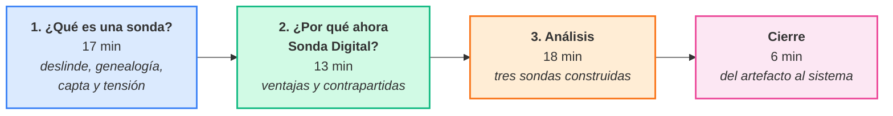

# Apertura (4 min)

## Paso 0. Tres sondas homónimas: el deslinde obligatorio

**Por qué va primero:** en una sala con gente de educación especial, "sonda" ya significa otra cosa. Si no se deslinda al comienzo, la mitad de la audiencia escuchará toda la charla pensando en diseños de sondeo múltiple. El deslinde no es un preámbulo: es el primer argumento.

**Qué se muestra:** una imagen de la Pioneer 10 con su placa dorada, y al lado la fotografía de un paquete de sonda cultural del Presence Project.

**Qué se dice:**

> La palabra evoca lo mismo en los tres casos: un instrumento que se lanza a un territorio al que no podemos ir, que opera solo y que devuelve **atisbos fragmentarios a lo largo del tiempo**. Esa es la metáfora buena. Pero bajo el mismo nombre conviven tres cosas incompatibles, y una de ellas vive justo en la disciplina de ustedes.

| | **Sonda espacial** | **Sonda conductual** | **Sonda de diseño** |
|---|---|---|---|
| **Objetivo** | Exploración física de cuerpos celestes | Medir la adquisición y generalización de una habilidad tras una intervención | Inspirar, generar empatía, explorar necesidades latentes |
| **Naturaleza del retorno** | Telemetría, imágenes, sensores (*data*) | Conductas observables y medibles (*data*) | Material subjetivo, visual y narrativo (*capta*) |
| **Rol de la persona** | Objeto pasivo de estudio | Sujeto de intervención | Co-creadora, experta en su propia experiencia |
| **Análisis** | Físico y modelización | Estadístico, análisis funcional de relaciones causa-efecto | Interpretativo, temático, hermenéutico |
| **Disciplina** | Astrofísica, ingeniería aeroespacial | Análisis aplicado de la conducta, educación especial | Diseño, HCI, antropología del diseño |

**Frase de cierre del paso:**

> La sonda conductual y la sonda de diseño no compiten: responden a preguntas distintas. Una demuestra una relación funcional. La otra abre un espacio de problema. Confundirlas produce dos errores simétricos: pedirle validez psicométrica a una sonda de diseño, o pedirle inspiración a un diseño de sondeo múltiple.

**Nota del orador:** dejar esta tabla en pantalla treinta segundos más de lo que parece necesario. Es la que evita el malentendido que arruinaría la discusión final.

## Paso 1. El gancho, y la incomodidad que organiza la charla

**Qué se dice:**

> En 1999, tres diseñadores del Royal College of Art repartieron paquetes a grupos de personas mayores en Noruega, Italia y Países Bajos. No había cuestionario, ni hipótesis, ni protocolo de análisis. Las instrucciones eran deliberadamente extrañas: "cuéntanos un chiste", "marca en el mapa un lugar al que te gustaría ir". Cuando les preguntaron qué medían, respondieron que nada. Buscaban inspiración.
>
> Yo diseño sondas para estudiantes universitarios autistas. Y la ambigüedad que Gaver celebra es, para muchos de ellos, exactamente el mecanismo por el cual quedan fuera.

**Idea fuerza:** esta no es una defensa de la sonda ni una aplicación de la sonda. Es una **revisión crítica desde el caso**.

**Nota del orador:** no adelantar la resolución. La tensión se sostiene hasta el paso 14.

## Paso 2. Aviso de método

**Qué se dice:** esta es una exposición de *research through design* (Frayling, 1993/4; Zimmerman, Forlizzi & Evenson, 2007). El argumento no se sostiene en un experimento sino en una colección de artefactos construidos y en las anotaciones que los acompañan. Al final voy a nombrar esa forma con precisión: portafolio anotado (Gaver & Bowers, 2012).

**Nota del orador:** este aviso vacuna contra la pregunta "¿y cuál es la muestra?". Mejor declararlo al inicio que defenderlo al final.

# Parte 1. ¿Qué es una sonda? (17 min)

## Paso 3. El origen: un gesto artístico, no psicométrico

**Referencia central:** Gaver, Dunne & Pacenti (1999).

**Qué se dice:** la sonda cultural nace en el Presence Project, financiado por la Comisión Europea. El problema era pragmático: comprender las vidas de personas mayores en tres comunidades europeas con las que no se podía mantener contacto presencial frecuente. La solución fue enviar paquetes con mapas, postales franqueadas, una cámara desechable y un álbum, acompañados de consignas evocadoras.

**La declaración que define el método:** los autores escriben que las sondas *no fueron diseñadas para ser analizadas*, y que no resumieron lo que revelaron; las propuestas de diseño reflejaron lo que aprendieron de los materiales. La inspiración no venía de la ciencia sino del arte: la **Internacional Situacionista** y su construcción deliberada de situaciones, con ecos del Dadaísmo y el Surrealismo en el uso de lo absurdo y lo lúdico[^situacionismo].

**El desplazamiento clave:** la sonda invierte la dirección de la mirada. El investigador no observa; **entrega un objeto y espera**. Quien decide qué mostrar, cuándo y en qué forma es la persona.

## Paso 4. La incertidumbre como recurso, no como defecto

**Referencia central:** Gaver, Boucher, Pennington & Walker (2004).

**Qué se dice:** cinco años después, los mismos autores publican una defensa explícita de la incertidumbre. El argumento es epistemológico, no estilístico: si el instrumento define de antemano qué cuenta como respuesta válida, solo puede confirmar lo que ya se sabía. La ambigüedad del estímulo abre el espacio a lo que el investigador no anticipó.

**Nota del orador:** hacer explícito el costo. Este método **no produce evidencia acumulable**. Es una decisión, no un descuido.

## Paso 5. La sonda es un acto de diseño, no un recipiente neutro

**Referencias:** Dunne (1999/2005); Dunne & Raby (2013); Wallace, McCarthy, Wright & Olivier (2013).

**Qué se dice:** Anthony Dunne, uno de los tres autores de 1999, escribe ese mismo año *Hertzian Tales*, donde formula el diseño crítico: el objeto que **encarna una pregunta** en lugar de resolver un problema. La sonda pertenece a esa familia.

Jayne Wallace aporta el término preciso: las sondas son **objetos artesanales dirigidos** (*directed craft objects*). Cada kit es único y se compone para una pregunta y un contexto específicos. No existen sondas listas para usar.

**La consecuencia que hay que subrayar:** el papel texturizado o la cartulina brillante, la caja misteriosa o el sobre transparente, el tono formal o coloquial de las instrucciones —nada de eso es decoración. Un kit que parece un juego recibe respuestas lúdicas; uno que parece un formulario recibe respuestas de formulario. **El cómo se pregunta determina en gran medida el qué se responde.**

**Por lo tanto:** el diseñador no es un observador neutral que prepara sus herramientas. Desde que concibe el kit, ya está interpretando el problema y construyendo el puente por el que llegará la respuesta. Este es el primer acto de investigación, y es un acto de diseño.

## Paso 6. Deudas disciplinares: la sonda como autoetnografía guiada

**Qué se dice:** las sondas no surgen en un vacío metodológico. Su premisa —que los objetos e imágenes son **cultura material** que porta ideas, creencias y prácticas— es antropológica. Lo que cambia es quién sostiene la cámara: en lugar de un etnógrafo que observa, se empodera a la persona para que sea **etnógrafa de su propia vida**, con las herramientas que el diseñador le entrega.

Tres herencias directas, que conviene nombrar porque reaparecen literalmente en las versiones digitales:

| Método antropológico | Su forma en la sonda | Su forma digital |
|---|---|---|
| Diario de campo | Cuaderno de actividades, dietario | Bitácora con momentos y marca temporal |
| Estudio con cámara | Cámara desechable con consigna | Cámara del teléfono, respuesta en foto |
| Testimonio e historia de vida | Consigna narrativa abierta | Respuesta en audio, mensaje al futuro |

## Paso 7. Dónde vive la sonda en el proceso: el Doble Diamante

**Qué se dice:** en el modelo del Doble Diamante, la sonda se sitúa inequívocamente en la primera fase del primer diamante —**Descubrir**— y en su tramo **divergente**. Su función es abrir el espacio del problema, no cerrarlo: mirar con ojos frescos, cuestionar los supuestos iniciales, sumergir al equipo en la complejidad del contexto.

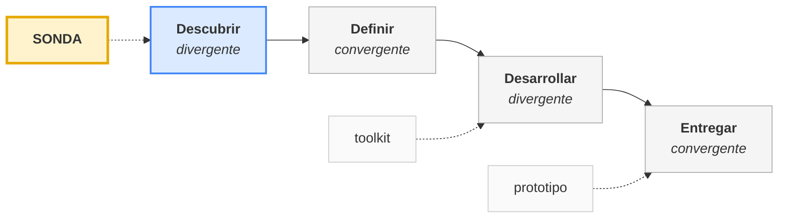

**Complemento (Sanders & Stappers, 2014):** las **sondas** provocan en la fase difusa inicial, los **toolkits** permiten expresarse generativamente, los **prototipos** confrontan hipótesis ya formuladas. El error más común —usar una sonda para validar— viene de ignorar este orden.

## Paso 8. Tipología: cuatro objetivos, tres formatos

**Qué se dice:** aunque cada kit es único, las sondas se clasifican con provecho. Esta tipología va a servir para ubicar las tres herramientas de la parte 3.

**Por objetivo:**

- **Inspiracionales** — fieles al propósito de Gaver: provocar lo inesperado, lo ambiguo, lo sorprendente.
- **Informativas** — recogen información contextual sobre prácticas, rutinas y problemas concretos, sin renunciar a la inspiración.
- **Participativas y de diálogo** — su foco es la relación: construir un tercer espacio de confianza y empoderar a la persona como codiseñadora.
- **Generativas** — entregan materiales para que la persona cree, esboce o construya sus propias soluciones.

**Por formato:**

- **Kits físicos** — el paquete tangible; su cualidad táctil y artesanal es parte de su eficacia.
- **Sondas móviles** — usan el teléfono que la persona ya tiene: cámara, grabadora, ubicación, en tiempo real y en contexto.
- **Sondas digitales o virtuales** — plataformas en línea, aplicaciones, bitácoras privadas; útiles a distancia y aptas para material multimedia.

**Nota del orador:** advertir que estas categorías no son excluyentes. Las tres herramientas de la parte 3 son híbridas, y ahí está lo interesante.

## Paso 9. Epistemología: de *data* a *capta*

**Referencia central:** Drucker (2011, 2014).

**Este es el paso que legitima la metodología ante una audiencia académica.** Conviene darle tiempo.

**Qué se dice:** *data* viene de *datum*, "lo dado": el término mismo afirma que la información preexiste en el mundo y que el observador solo la registra. Johanna Drucker propone **capta**, de *capere*, "tomar": conocimiento activamente tomado, construido e interpretado. La investigación humanista no trabaja con *data* sino con *capta*, porque todo conocimiento es **situado, parcial y constitutivo**.

Su advertencia más filosa: las visualizaciones convencionales operan como un **caballo de Troya intelectual**. Al presentar la información limpia y geométrica, ocultan que fue construida y hacen que el *capta* parezca *data*.

**Por qué la sonda es la encarnación metodológica del *capta*:** el proceso completo es una cadena de cuatro actos constructivos, y en ninguno de ellos la objetividad es siquiera el objetivo.

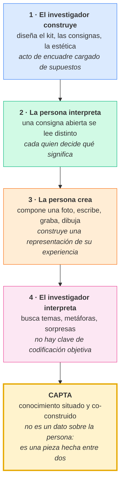

**Consecuencia para el análisis:** si lo que se obtiene es *capta*, el análisis no puede buscar generalización estadística ni prueba de causalidad. Las técnicas apropiadas son otras: **exhibición y discusión** del material desplegado en una pared, **análisis temático** de recurrencias, metáforas, contradicciones y momentos emocionalmente resonantes, **mapas de afinidad y collages**. El valor no está en un informe de hallazgos sino en una comprensión que permita hacer mejores preguntas.

## Paso 10. La domesticación: cómo HCI convirtió la sonda en formulario

**Referencias:** Boehner, Vertesi, Sengers & Dourish (2007); Dourish (2006).

**Qué se dice:** Boehner y sus colegas revisan la literatura de HCI que dice usar sondas y encuentran un patrón: casi todos conservan el paquete y descartan la epistemología. La sonda se vuelve una técnica más de *requirements gathering*, evaluada por si "funciona" —si produce insumos para el brief. Se pierde exactamente lo que la hacía valiosa: el compromiso con no saber. En términos de Drucker: se tomó el *capta* y se lo trató como *data*.

**Enlace con Dourish (2006):** la crítica es la misma que él dirige a la etnografía en HCI. Reducir un método interpretativo a una fábrica de *implications for design* es extractivismo metodológico.

**Nota del orador:** este paso es el pivote crítico de toda la primera parte. Sin él, la parte 2 suena a entusiasmo tecnológico.

## Paso 11. La rehabilitación: la sonda funciona por la relación

**Referencias:** Wallace et al. (2013); Mattelmäki (2006).

**Qué se dice:** Wallace y colegas responden a la crítica sin abandonar el método. Su hallazgo: las sondas funcionan cuando están sostenidas por una **relación de cuidado y compromiso mutuo**, no por un protocolo. El objeto es la excusa; el vínculo es el instrumento.

Mattelmäki, desde Helsinki, sistematiza la variante *design probes*, adaptada al diseño centrado en el humano. Su aporte es una tensión productiva: sin traicionar el propósito inspiracional, admite que el material devuelto también aporta **datos informacionales** sobre prácticas concretas y **datos empáticos** que ayudan a comprender el mundo de la persona. El análisis que propone no es estadístico sino cualitativo y temático.

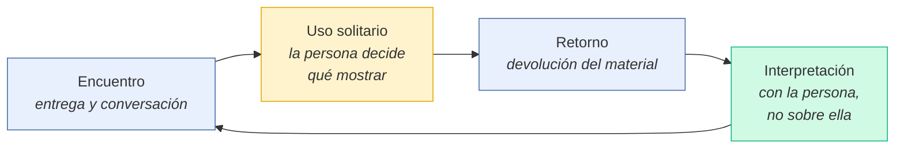

## Paso 12. El giro inclusivo

**Referencias:** Walmsley & Johnson (2003); Nind (2014).

**Qué se dice:** en paralelo, en estudios de discapacidad, se consolida la investigación inclusiva: investigar **con** y no **sobre**. Nind fija condiciones mínimas: que las personas afectadas participen en la definición del problema, que el proceso sea accesible y que los resultados les sean útiles.

**Convergencia:** la sonda es estructuralmente afín. Devuelve el encuadre; quien responde decide el recorte. Y es **inclusiva por diseño** en un sentido muy concreto: la entrevista, el grupo focal y la encuesta dependen fuertemente de la competencia lingüística y verbal. Una sonda lúdica, visual, táctil y abierta a la expresión no verbal es apta para participantes —niños, personas con discapacidad intelectual o del desarrollo, personas que se expresan mejor creando que hablando— a quienes los métodos verbales excluyen silenciosamente.

## Paso 13. La tensión: cuando la ambigüedad es la barrera

**Referencias:** Nicolaidis et al. (2019); Stacey & Cage (2023); Spencer González et al. (2020).

**Qué se dice:** aquí el argumento se complica, y es el punto más interesante de la charla. Las guías de AASPIRE, elaboradas con personas autistas como co-investigadoras, y el estudio de Stacey y Cage —cuyo título es literalmente *"Simultaneously vague and oddly specific"*— muestran que los instrumentos ambiguos producen en personas autistas carga cognitiva, respuestas fabricadas por presión de completitud y abandono. La ambigüedad que Gaver celebra puede ser, para este grupo, exactamente el mecanismo de exclusión.

**Formulación del problema en pantalla:**

> Si la ambigüedad es el motor generativo de la sonda, y la ambigüedad excluye a quienes quiero incluir, ¿queda algo que siga siendo una sonda?

**Nota del orador:** pausa. Dejar que la pregunta incomode antes de responderla.

## Paso 14. La resolución: dos ambigüedades, no una

**Esta es la contribución conceptual de la charla.** Enunciarla despacio y volver a ella en el cierre.

Gaver no distingue dos cosas que en la práctica se separan:

1. **Ambigüedad del estímulo** — la consigna no dice qué se espera. "Toma una foto de algo aburrido."
2. **Apertura del espacio de respuesta** — la respuesta no está tipificada de antemano: cualquier forma, cualquier contenido, cualquier extensión, e incluso el silencio.

La sonda cultural clásica maximiza ambas. Pero **solo la segunda es constitutiva del método**. La primera es un medio históricamente contingente —adecuado a participantes que disfrutan la deriva interpretativa— para lograr la segunda.

Con participantes para quienes esa deriva es costosa, se puede **desambiguar el estímulo y conservar, incluso ampliar, la apertura de la respuesta**: instrucción clara, ejemplo concreto de andamiaje, anclaje a un evento reciente y específico, y opción de salida explícita ("si no ocurrió, también puedes decirlo")[^opcionsalida].

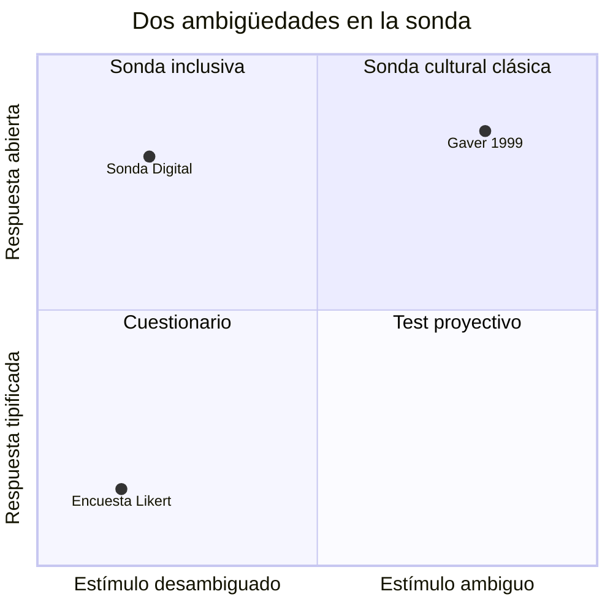

**Consecuencia:** desambiguar el estímulo no traiciona el método. Traicionarlo sería cerrar la respuesta. Y en términos de Drucker: la desambiguación reduce el ruido del acto 2 (la interpretación de la consigna) para proteger la riqueza del acto 3 (la creación de la respuesta).

# Parte 2. ¿Por qué ahora "Sonda Digital"? (13 min)

## Paso 15. No es una idea nueva, y conviene decirlo

**Referencias:** Iversen & Nielsen (2003); Hutchinson et al. (2003); Hulkko, Mattelmäki, Virtanen & Keinonen (2004).

**Qué se dice:** el término *digital cultural probes* tiene más de veinte años. Hutchinson y un consorcio europeo formularon las *technology probes*: artefactos funcionales y simples, desplegados en hogares reales, con tres objetivos simultáneos —recoger datos de uso, provocar la reflexión de las familias y testear una tecnología. Hulkko y colegas publicaron *Mobile Probes*: sondas enviadas y respondidas por teléfono móvil.

**Por qué "ahora" entonces:** no cambió la idea. Cambiaron tres condiciones materiales.

## Paso 16. Qué cambió: tres condiciones materiales

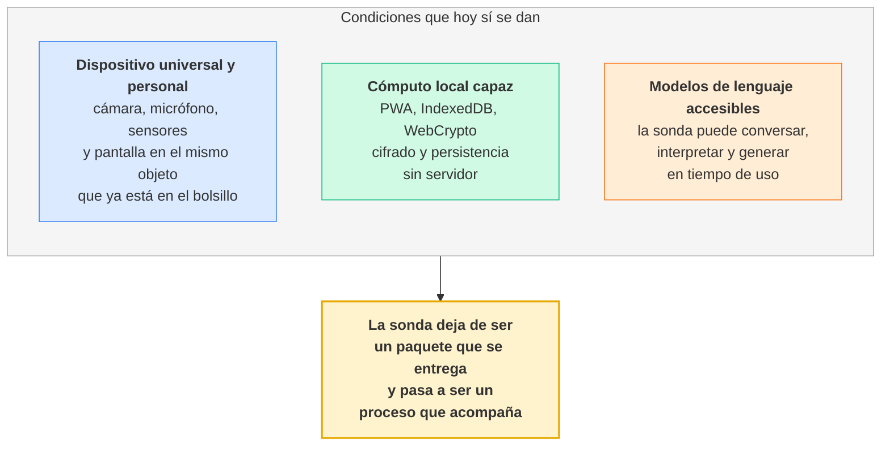

## Paso 17. Ventaja 1 — El ritmo: de la entrega al tempo

**Qué se dice:** la sonda de papel tiene dos eventos: entrega y retorno. Todo lo que ocurre entre medio es una caja negra, y el material vuelve teñido de reconstrucción retrospectiva. La sonda digital tiene **tempo**.

**Evidencia del caso:** en Sonda, la experiencia se organiza en doce momentos que se desbloquean progresivamente, uno por día hábil o uno cada dos días. La decisión está documentada: se descartó la estructura semanal porque una semana diluye la tensión narrativa y rompe el hilo. Cada momento contiene **una sola actividad**, para no sobrecargar.

**Nota del orador:** marcar la deuda con los *diary studies* y el *experience sampling*, y la diferencia: la sonda no muestrea estados para agregarlos, provoca relatos para interpretarlos. Sigue siendo *capta*.

## Paso 18. Ventaja 2 — La multimodalidad deja de ser un lujo logístico

**Qué se dice:** Gaver ya entregaba cámaras desechables. El teléfono colapsa la cámara, la grabadora y el cuaderno en un objeto que la persona ya sabe usar. Cada actividad de Sonda declara sus modalidades admitidas —texto, audio, fotografía— y quien responde elige.

**Por qué es un argumento de inclusión y no de conveniencia:** obligar a escribir es un filtro. Ofrecer audio y fotografía no es dar más opciones: es **retirar una barrera** que operaba silenciosamente en la selección de quién puede participar. Es la promesa del paso 12, cumplida por medios digitales.

## Paso 19. Ventaja 3 — El instrumento se adapta al cuerpo, en tiempo de uso

**Qué se dice:** esto el papel no puede hacerlo, y es la ventaja más subestimada. Sonda incorpora un perfil sensorial modificable durante el estudio: temas visuales (calma, cálido, alto contraste), ajuste de tamaño y tipografía para dislexia, reducción de movimiento para evitar sobrecarga vestibular, y generador de ruido de fondo blanco, rosa o marrón.

**El argumento fuerte:** la accesibilidad deja de ser una adaptación posterior del investigador y pasa a ser una **capacidad del instrumento ejercida por el participante**. Y la configuración se exporta: el perfil elegido es en sí mismo *capta* sobre autoconocimiento sensorial.

## Paso 20. Ventaja 4 — Instrumentar lo no verbal, y el filo que eso abre

**Qué se dice:** Sonda incluye un fidget: un juego de física donde se arrastra y suelta una pelota para derribar torres de cubos. Está siempre disponible, con independencia del avance en los momentos. Su función declarada es la autorregulación, no la medición. Su uso deja traza —duración, disparos, arrastres— que puede leerse junto al relato autorreportado. Es un canal que **no pasa por el lenguaje**, en una población para la que el reporte verbal de estados internos puede ser costoso.

**Y aquí hay que detenerse, porque es el punto ético más delicado de toda la charla.**

La sonda nació como **recolección activa**: depende del consentimiento explícito, la implicación consciente y el esfuerzo creativo de la persona. Ese es su contraste con el paradigma dominante de la era digital, la **recolección pasiva**: geolocalización, historial, tiempo de permanencia, sensores, patrones de uso; consentimiento reducido a una casilla en términos que nadie lee; anonimización frágil; sesgo estructural de plataforma.

Una traza pasiva de uso del fidget es, técnicamente, recolección pasiva. Es exactamente el gesto que la sonda existía para no hacer.

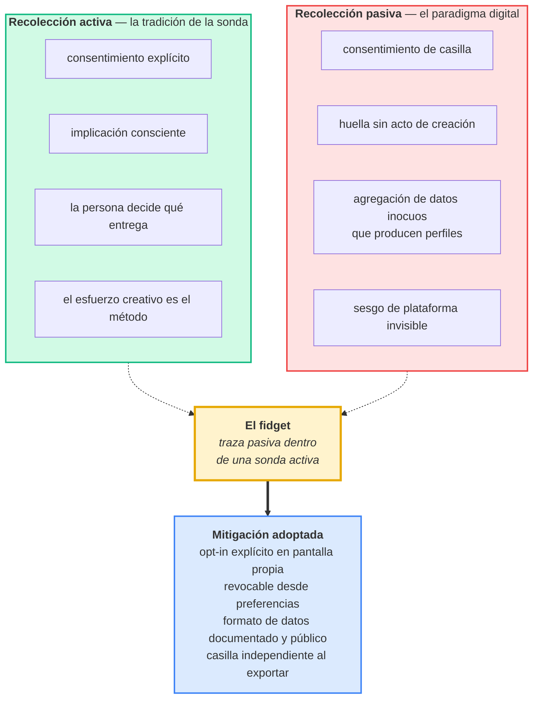

**Qué se dice para cerrar el paso:**

> No presento esto como un problema resuelto. Lo presento como el lugar donde la sonda digital puede dejar de ser una sonda sin que nadie lo note. La única defensa que conozco es hacer que cada canal pasivo sea una decisión visible, reversible y separable: se activa aparte, se revoca aparte y se exporta aparte.

## Paso 21. Ventaja 5 — La soberanía del dato, invertida por diseño

**Qué se dice:** este es el punto donde la digitalización se usa contra su propia tendencia. Lo digital, por defecto, significa servidor, telemetría y asimetría. La arquitectura de Sonda hace lo contrario, y esa inversión es la respuesta constructiva a la tensión del paso anterior.

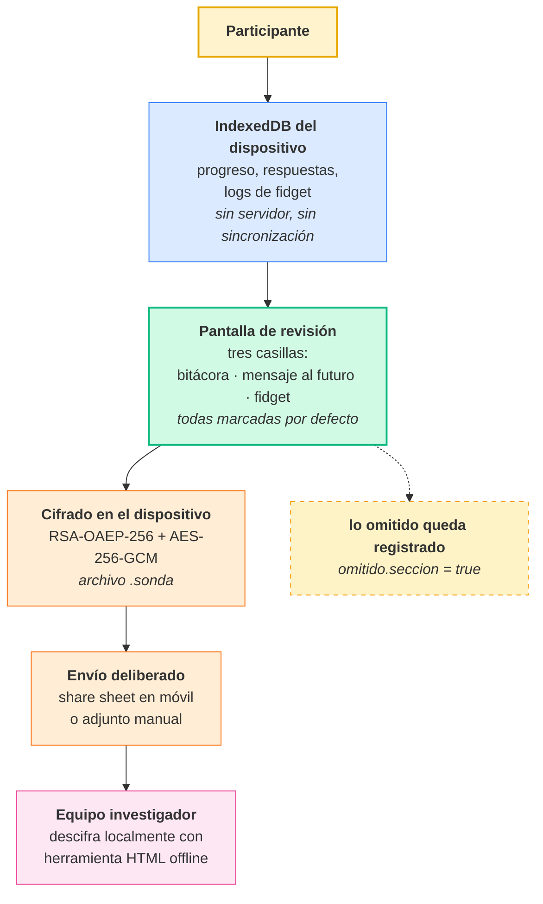

**Los dos detalles que conviene subrayar:**

Primero, el retiro del estudio y el borrado de datos son **acciones separadas**. Retirarse no obliga a destruir el propio material, y borrar no obliga a abandonar.

Segundo, y esto es metodológicamente más fino: la omisión se registra. El esquema exportado guarda un campo `omitido` por sección. **Lo que la persona decidió no mostrar es *capta*, no un vacío.** Es la formalización digital de algo que la sonda de papel siempre supo: la postal que no se devuelve dice algo.

## Paso 22. Ventaja 6 — El *capta* nace anotado

**Qué se dice:** el archivo exportado tiene versión de esquema (`schemaVersion: 2.0`) y trae la teoría inscrita: cada momento declara su `tac_dimension` y `tac_subdimension` según la Teoría de la Agencia Causal (Shogren et al., 2015; Shogren & Raley, 2022). Las respuestas llevan modalidad y marca temporal.

**Doble filo, y hay que declararlo:** un material que nace codificado según una teoría **facilita el análisis y sesga el hallazgo**. Es el riesgo de Boehner reapareciendo por la puerta trasera, y es exactamente el caballo de Troya de Drucker: la estructura limpia del JSON hace que el *capta* parezca *data*. La mitigación es que la codificación teórica acompaña, pero no reemplaza, el material bruto multimodal, que sigue exigiendo lectura interpretativa.

## Paso 23. Las contrapartidas, sin adornos

| Contrapartida | En qué consiste | Mitigación adoptada |
|---|---|---|
| **Reinstrumentalización** | si el esquema JSON precede a la pregunta, la sonda vuelve a ser formulario | el guión de actividades se escribe antes que el esquema; el esquema versiona, no define |
| **Pérdida de materialidad** | el paquete de papel tiene peso, ocupa la mesa, es un objeto artesanal que se habita (Mattelmäki, 2006; Wallace et al., 2013) | reemplazo parcial vía objeto interactivo persistente: el fidget como presencia material del estudio |
| **Brecha y carga del dispositivo** | requiere teléfono propio, batería, espacio, alfabetización | PWA instalable, funcionamiento sin conexión, sin cuenta ni registro |
| **Deriva hacia lo pasivo** | el registro no verbal es, técnicamente, vigilancia | opt-in explícito y separable, revocable, con formato documentado y público |
| **Falso confort del volumen** | más registro no es más comprensión; invita a tratar el *capta* como *data* | la unidad de análisis sigue siendo el caso interpretado, no el agregado |

**Nota del orador:** dedicar tiempo real a esta tabla. Una charla que solo enumera ventajas se lee como demostración de producto.

# Parte 3. Análisis de tres sondas construidas (18 min)

## Paso 24. La premisa del análisis

**Qué se dice:** las tres herramientas no son tres versiones del mismo instrumento ni tres etapas de un proceso. Son **tres posiciones distintas en un espacio de diseño**, y cada una responde una pregunta que las otras no pueden. Su valor conjunto es el de un portafolio anotado.

Dos ejes organizan el espacio:

- **¿Quién toma la iniciativa?** ¿Habla primero el sistema o la persona?
- **¿Qué se busca conocer?** ¿A la persona, a un constructo, o a una experiencia desplegada en el tiempo?

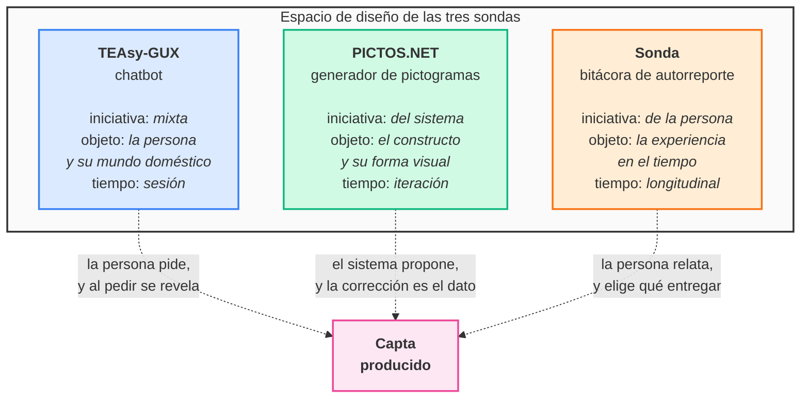

## Paso 25. Sonda 1 — El chatbot como sonda: TEAsy-GUX

**Contexto:** proyecto Fondef T·easy.life, dirigido por la Dra. Vanessa Vega (PUCV), con la Universidad de Las Américas. Agente conversacional en LangChain con interfaz Gradio, orientado a apoyar actividades de la vida diaria (AVD) de personas adultas autistas en el hogar.

**Tipología:** sonda **informativa y de diálogo**, en formato **digital**, con un componente de servicio real.

**La inversión metodológica:** la persona cree que está pidiendo ayuda. Y la está pidiendo, de verdad. Pero **al pedir, revela su mundo**: qué actividad le cuesta, en qué granularidad necesita la instrucción, qué vocabulario usa, dónde están las cosas en su casa, a qué hora pregunta. La sonda no interroga: **ofrece una utilidad y escucha la demanda**.

**El instrumento es el prompt.** Este es el punto a defender con fuerza ante una audiencia de diseño: el *system prompt* no es configuración técnica, es el **objeto artesanal dirigido** de Wallace, escrito en texto. En él están inscritas decisiones que en un método clásico irían en el protocolo:

- una taxonomía completa de AVD que define el universo de lo preguntable (higiene, salud y alimentación, seguridad y hogar, ocio, socialización y transporte, trabajo y educación);
- una postura teórica declarada: paradigma de la neurodiversidad y enfoque de derechos humanos;
- una regla de registro lingüístico: evitar tecnicismos clínicos como "TEA" salvo que la persona los prefiera;
- una **delimitación ética explícita del alcance**: el agente declara que no da contención emocional y deriva a Salud Responde, a la atención en lengua de señas chilena y a la línea de prevención del suicidio;
- una tabla de derivación de emergencia con los números chilenos correspondientes.

**Qué produce:** el historial completo de cada sesión se guarda como JSON asociado a un identificador aleatorio, con estructura de roles `system` / `user` / `assistant`, organizado por año, mes y fecha. Se registra además valoración explícita turno a turno mediante *like* y *dislike*, en archivo separado.

**Lo que enseña que las otras dos no pueden:** el **léxico y la demanda espontánea**. Ninguna bitácora de autorreporte captura qué palabras usa la persona cuando quiere algo, ni qué pregunta a las once de la noche.

**Riesgo específico, y hay que nombrarlo:** la asimetría. Un instrumento que se presenta como servicio y opera como investigación erosiona el consentimiento si esa doble condición no está declarada. La mitigación implementada es una herramienta del agente —`project_information`— que devuelve, a demanda, el propósito del estudio, la voluntariedad, el derecho a retiro sin explicaciones, la confidencialidad y el contacto de la investigadora responsable. Es correcto, pero **es reactivo**: se activa si la persona pregunta. Una anotación honesta del portafolio dice que el consentimiento debería ser un evento de apertura, no una respuesta disponible.

**Segunda observación para la anotación:** el directorio donde se depositan las conversaciones se llama `conversaciones_públicas`. Aun si el contenido no se publica, el nombre de una ruta es una declaración de política de datos. Contrastado con la arquitectura local-first de Sonda, la distancia entre ambas posiciones es una de las tensiones más productivas del portafolio.

## Paso 26. Sonda 2 — El generador como sonda de constructos: PICTOS.NET

**Contexto:** plataforma de pictogramas generativos para Comunicación Aumentativa y Alternativa. Cuatro fases, cada una visible, editable y regenerable de forma independiente.

**Tipología:** sonda **generativa**, en formato **digital**, con una inversión de la dirección habitual.

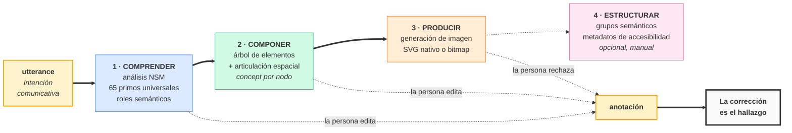

**La inversión metodológica, la más radical de las tres:** aquí **el sistema habla primero**. Propone una interpretación del significado —qué es el agente, qué la acción, qué elementos visuales corresponden— y la materializa. La persona corrige. **La corrección es el *capta*.**

Una sonda clásica pregunta "¿qué significa para ti *ducharse*?" y recibe una respuesta verbal, condicionada por la capacidad de verbalizar un constructo. PICTOS entrega una hipótesis visual explícita y observa **dónde se rompe el acuerdo**. Es más barato equivocarse que preguntar bien.

**El cruce con el portafolio anotado (Gaver & Bowers, 2012; Bowers, 2012; Löwgren, 2013):** un portafolio anotado es una colección de artefactos más las anotaciones que hacen visibles sus dimensiones. PICTOS produce exactamente eso, con dos diferencias que vale la pena examinar.

| | Portafolio anotado clásico | PICTOS.NET |
|---|---|---|
| Quién anota | el investigador-diseñador | el sistema propone, la persona corrige |
| Cuándo | *post hoc*, sobre la colección terminada | *ex ante*, la anotación precede al artefacto |
| Forma de la anotación | prosa que nombra dimensiones | estructura tipada: `frames`, `elements`, `concept` |
| Función | comunicar el valor del RtD a terceros | producir el artefacto y registrar el disenso |

La anotación deja de ser un comentario sobre la obra y pasa a ser **la causa de la obra**. Y como es estructura tipada y no prosa, resulta acumulable y comparable entre casos: el `data-concept` semántico viaja desde el análisis lingüístico hasta el SVG final.

**Qué produce:** por cada expresión, el esquema NLU completo (dominio, marcos, explicaciones NSM, pragmática), el árbol de elementos visuales con su concepto semántico, el prompt de composición espacial, el SVG o bitmap resultante y el SVG estructurado con metadatos de accesibilidad. Y de manera crucial, la **traza de invalidación**: qué campos editó la persona y qué fases quedaron marcadas como desactualizadas.

**Evaluabilidad:** los pictogramas resultantes pueden puntuarse con el marco ICAP, lo que permite cerrar el ciclo entre disenso registrado y calidad medida.

**Lo que enseña que las otras dos no pueden:** el **contenido interno de un constructo compartido**, y dónde falla la convención visual. Es la única de las tres que produce conocimiento sobre el significado en vez de sobre la persona.

**Riesgo específico:** el sistema ancla. Al proponer primero, condiciona lo que la persona corrige. El disenso registrado es disenso *respecto de la propuesta de la máquina*, no del espacio completo de interpretaciones posibles. Se mitiga con regeneración desde cero y comparación entre variantes, pero no se elimina.

## Paso 27. Sonda 3 — La bitácora de autorreporte: Sonda

**Contexto:** FONDECYT Regular 1251541 (ANID), investigadora responsable Dra. Vanessa Vega Córdova (PUCV). Estudiantes universitarios autistas. Aplicación web progresiva.

**Tipología:** sonda **informativa y participativa**, en formato **móvil**, heredera directa del diario de campo y del estudio con cámara.

**La posición:** es la más cercana al canon —un instrumento que se entrega y con el que la persona compone su relato— y a la vez la que más se aleja de él en la ejecución, porque desambigua sistemáticamente el estímulo.

**La estructura como argumento:** doce momentos más una entrada sensorial y un cierre opcional, alineados con las tres características de la Teoría de la Agencia Causal. La entrada no evalúa ninguna subdimensión: establece una base de autoconocimiento sensorial sobre la que se apoyan después la autorregulación y el autoconcepto.

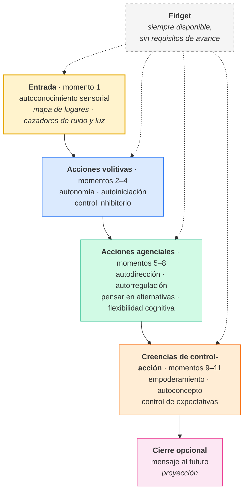

**Los siete principios de escritura de las preguntas** —donde se materializa la resolución del paso 14:

1. instrucciones claras y específicas;
2. ejemplos concretos como andamiaje junto a cada pregunta;
3. respuesta multimodal a elección;
4. **anclaje de evento**: recordar un episodio específico y reciente, nunca responder en abstracto;
5. **opción de salida explícita**: "si no ocurrió, también puedes decirlo";
6. sin metáforas abstractas ni supuestos no verificados;
7. contexto explícito: cada pregunta valida la experiencia antes de preguntar.

**Ejemplo para leer en voz alta** (momento 4, control inhibitorio):

> "A veces, mientras estudiamos, aparece algo que nos da ganas de parar o de hacer otra cosa: el teléfono, un ruido, ganas de levantarse. Piensa en un momento reciente en que sentiste esas ganas de interrumpir lo que hacías, pero decidiste seguir. ¿Qué hiciste para mantenerte en la tarea? Si en cambio dejaste la tarea, también puedes contarlo, no hay respuesta correcta."

**Análisis del ejemplo, frase por frase:** la primera oración normaliza y da ejemplos concretos de distractores. La segunda ancla en un evento específico y reciente. La tercera pregunta por la estrategia, no por el rasgo. La cuarta abre la salida y desactiva la deseabilidad social. **El estímulo está completamente desambiguado y la respuesta sigue completamente abierta**: puede ser texto, audio o foto, tres palabras o un párrafo, y puede ser un relato de fracaso.

**Qué produce:** respuestas multimodales por actividad con marca temporal y modalidad; perfil sensorial elegido; registro opcional de uso del fidget; y el mapa de omisiones. Todo bajo esquema versionado, cifrado y entregado por decisión de la persona.

**Lo que enseña que las otras dos no pueden:** la **trayectoria**. Cómo cambia la estrategia de una persona a lo largo de semanas, y qué relación hay entre la carga sensorial reportada en la entrada y las estrategias de regulación que aparecen después.

**Riesgo específico:** el andamiaje induce. Un ejemplo concreto reduce la carga cognitiva y, simultáneamente, orienta el contenido de la respuesta. Es un intercambio deliberado, y el análisis debe tratarlo como tal: no leer la coincidencia entre ejemplo y respuesta como hallazgo.

## Paso 28. Las tres en la tipología clásica

Antes de la tabla grande, una lámina corta que las ubica en el marco del paso 8. Sirve para mostrar que ninguna es pura.

| | Inspiracional | Informativa | Participativa / diálogo | Generativa | Formato |
|---|:---:|:---:|:---:|:---:|---|
| **TEAsy-GUX** | | fuerte | fuerte | | digital, conversacional |
| **PICTOS.NET** | media | | media | fuerte | digital, iterativo |
| **Sonda** | media | fuerte | fuerte | | móvil, longitudinal |

**Observación para decir en voz alta:** ninguna de las tres es primariamente inspiracional. Es una consecuencia directa del paso 14: al desambiguar el estímulo para incluir, se sacrifica parte del rendimiento inspiracional a cambio de acceso. Es el costo del método, y conviene nombrarlo antes de que lo nombre la audiencia.

## Paso 29. Tabla comparativa

Esta es la lámina que la audiencia va a fotografiar. Entregarla también impresa o como enlace.

| | **TEAsy-GUX** | **PICTOS.NET** | **Sonda** |
|---|---|---|---|
| **Modalidad** | Conversación de texto en interfaz web (Gradio); agente LLM con herramientas. Digital, sin materialidad física | Aplicación web de generación visual: canalización de cuatro fases, cada una visible, editable y regenerable | Aplicación web progresiva instalable, offline-first; respuesta en texto, audio y fotografía; perfil sensorial configurable |
| **Interacción** | Iniciativa mixta y reactiva. La persona pregunta; el sistema responde y deriva. Sesión única o recurrente, sin estructura temporal impuesta | Iniciativa del sistema. Propone una interpretación semántica y visual; la persona edita cualquier campo e invalida las fases posteriores. Ciclo iterativo de propuesta y corrección | Iniciativa de la persona dentro de un ritmo pautado. Doce momentos con desbloqueo progresivo por día hábil, una actividad por momento. Fidget siempre disponible |
| **Datos que recoge** | Corpus conversacional completo por sesión (`system`/`user`/`assistant`) con identificador aleatorio; valoración explícita turno a turno (*like*/*dislike*); tópicos de AVD demandados; léxico y granularidad de instrucción solicitada | Esquema NLU (dominio, marcos, explicaciones NSM, pragmática); árbol de elementos visuales con concepto semántico; prompt de composición; SVG o bitmap; SVG estructurado con metadatos; **traza de edición e invalidación**; puntuación ICAP opcional | Respuestas multimodales con modalidad y marca temporal por actividad; dimensión y subdimensión TAC por momento; perfil sensorial elegido; sesiones de fidget (duración, disparos, arrastres) bajo consentimiento; **mapa de omisiones** |
| **Enfoque** | Etnográfico y situado. Conocer a la persona por su demanda espontánea de apoyo, en su propio vocabulario. Recolección activa con un canal de servicio real | Semiótico y generativo. Conocer un constructo compartido observando dónde se rompe el acuerdo entre la propuesta del sistema y la corrección de la persona | Fenomenológico y longitudinal. Conocer la experiencia vivida de la autodeterminación, anclada en episodios concretos, a lo largo del tiempo |
| **Implicancias** | El *system prompt* es el instrumento de investigación: taxonomía, postura teórica, registro lingüístico y límites éticos están inscritos en él. Riesgo de asimetría: servicio y estudio en el mismo acto. El consentimiento es reactivo, no un evento de apertura. La ruta `conversaciones_públicas` declara una política de datos que conviene revisar | La anotación precede al artefacto y lo causa; deja de ser comentario y pasa a ser estructura tipada, acumulable y comparable. Riesgo de anclaje: el disenso lo es respecto de lo que la máquina propuso. La edición de la persona debe conservarse como dato de primera clase, no como estado intermedio | La desambiguación del estímulo no cierra la respuesta. La accesibilidad es una capacidad del instrumento ejercida por el participante, no un ajuste del investigador. La soberanía del dato es condición metodológica, no cumplimiento normativo. Riesgos: inducción por andamiaje y deriva hacia la recolección pasiva vía traza del fidget |
| **Sentidos derivados** | Un mapa de la demanda cotidiana: qué se pide, cómo se nombra, cuándo y con qué nivel de detalle. Permite dimensionar la distancia entre la taxonomía experta de AVD y la taxonomía vivida | Una cartografía del significado visual: qué primitivos semánticos resisten la traducción a imagen, qué convenciones fallan, y en qué punto de la cadena de interpretación se rompe el acuerdo. Insumo directo para estándares de CAA | Una trayectoria de agencia: cómo el autoconocimiento sensorial inicial se relaciona con las estrategias de regulación posteriores, qué barreras del entorno académico son recurrentes y qué apoyos la persona es capaz de formular y pedir |

## Paso 30. Las cinco anotaciones del portafolio

**Qué se dice:** individualmente, cada herramienta es un caso. Juntas son un portafolio, y el portafolio permite formular anotaciones que ningún caso soporta por sí solo. Estas cinco son las que propongo.

**Anotación 1 — Desambiguar el estímulo no cierra la respuesta.** Las tres desambiguan y ninguna tipifica: la bitácora con instrucción clara, la conversación con alcance declarado, el generador con hipótesis explícita. En los tres casos queda abierto qué contesta la persona, no qué se le pregunta.

**Anotación 2 — La corrección y la omisión son *capta* primario.** No son ruido ni pérdida. PICTOS registra qué editó la persona; Sonda registra qué decidió no entregar; TEAsy registra qué respuesta rechazó. En los tres casos, **el material más informativo es el desacuerdo**.

**Anotación 3 — El alcance declarado es un acto de diseño ético.** El *system prompt* de TEAsy dice explícitamente lo que no hará. Sonda separa retiro de borrado. PICTOS distingue las fases automáticas de la fase que solo inicia la persona. Declarar el límite tiene la misma jerarquía que cualquier decisión de forma.

**Anotación 4 — El instrumento se adapta al cuerpo, y esa adaptación es *capta*.** Es privilegio exclusivo de lo digital y la ventaja más subestimada de la sonda digital. El perfil sensorial que la persona elige es a la vez condición de acceso y hallazgo.

**Anotación 5 — Toda sonda digital tiene un canal pasivo, y hay que hacerlo visible o no ponerlo.** Es la anotación más incómoda y la más útil. Lo digital genera huella por defecto: sesiones, tiempos, secuencias. Una sonda que recoge esa huella sin declararla ha cambiado de género sin avisar. La regla que propongo es simple: **cada canal pasivo debe activarse aparte, revocarse aparte y exportarse aparte.**

# Cierre (6 min)

## Paso 31. Definición de trabajo

**Qué se muestra en pantalla, sola:**

> **Sonda digital**: artefacto interactivo, situado en el dispositivo de la persona, que provoca la producción autodirigida de material sobre la propia experiencia, adaptando su forma al cuerpo de quien responde y dejando en manos de esa persona la decisión de qué se entrega. Lo que devuelve no es *data* sino *capta*: conocimiento tomado, construido entre dos. Su rendimiento epistemológico no está en el volumen sino en **el registro de aquello en lo que la persona y el sistema no coinciden**.

## Paso 32. Del artefacto al sistema: por qué esto importa más allá del caso

**Referencia:** Banathy (1991, 1996).

**Qué se dice:** todo lo anterior ocurre a microescala: una app, una conversación, un pictograma. Bela Banathy da la escala mayor. Su premisa es que los sistemas sociales —la educación entre ellos— no deben ser diseñados por expertos externos sino por sus propios *stakeholders*: quienes sirven, son servidos y son afectados por el sistema. Para él, el diseño participativo no es una opción metodológica sino un derecho, y una condición de la democracia.

Su proceso tiene tres etapas en espiral:

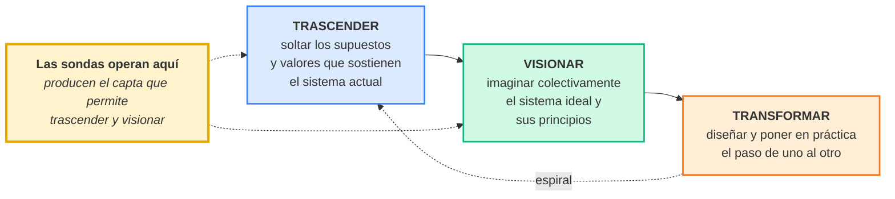

**El argumento de cierre:**

> Las sondas son una herramienta de microescala para un objetivo de macroescala. Cuando un estudiante autista fotografía la cafetería donde se siente abrumado, no está entregando un dato sobre sí mismo: está aportando el material con el que se puede **trascender** el supuesto de que el campus es neutro, y **visionar** una universidad distinta. Las voces que rara vez entran en el debate de política educativa se convierten en la fuente primaria del rediseño.
>
> Y volviendo a la incomodidad del comienzo: la ambigüedad no era el método. Era un medio de una época, adecuado a unos participantes. Lo que había debajo era otra cosa —renunciar a saber de antemano qué cuenta como respuesta válida— y eso sí es irrenunciable. Una sonda que le dice a alguien exactamente qué recordar, en el formato que quiera, con permiso explícito para decir que no ocurrió y con la decisión final sobre qué entregar, es más fiel al proyecto de Gaver que muchos paquetes de postales repartidos en su nombre.

## Preguntas para abrir la discusión

Cuatro preguntas preparadas, por si la sala no arranca:

1. Si la corrección y la omisión son el *capta* principal, ¿cómo se codifica un silencio deliberado en un análisis temático?
2. ¿Puede un sistema generativo ser sonda sin anclar? ¿O el anclaje es el precio inevitable de que la máquina hable primero?
3. ¿Qué se pierde cuando la sonda deja de ser un objeto que ocupa la mesa? ¿Es recuperable en pantalla, o hay que aceptar la pérdida?
4. Para quienes trabajan en educación especial: ¿qué pasaría si una sonda de diseño precediera a cada diseño de sondeo múltiple? ¿Cambiaría lo que se decide medir?

# Notas de producción

**Reparto del tiempo:**

| Bloque | Pasos | Minutos |
|---|---|---|
| Apertura | 0–2 | 4 |
| Parte 1 | 3–14 | 17 |
| Parte 2 | 15–23 | 13 |
| Parte 3 | 24–30 | 18 |
| Cierre | 31–32 | 6 |
| Discusión | | 10 |

**Láminas que conviene preparar con cuidado:** la tabla de deslinde del paso 0, la cadena del *capta* del paso 9, el cuadrante del paso 14, el diagrama activo/pasivo del paso 20, la tabla comparativa del paso 29 y la definición del paso 31.

**Si hay que recortar a 30 minutos:** conservar íntegros los pasos 0, 9, 14, 20 y 29. Comprimir la parte 1 a los pasos 3, 5, 9, 10, 13 y 14. Eliminar los pasos 6, 7, 15 y 22.

**Demostración en vivo, si el tiempo lo permite:** tres minutos de PICTOS generando un pictograma y siendo corregido en la fase 2 es la mejor ilustración posible de la anotación 2. Requiere conexión.

**Material de apoyo sugerido:** entregar el informe previo *Sondas de Diseño: Una Metodología Exploratoria para la Investigación Participativa en Educación Especial* como lectura complementaria, y esta tabla comparativa impresa.

# Bibliografía

Las referencias fueron verificadas contra Crossref, repositorios institucionales o catálogos editoriales. Las incertidumbres se señalan al pie.

**Sondas: origen, crítica y rehabilitación**

Boehner, K., Vertesi, J., Sengers, P., & Dourish, P. (2007). How HCI interprets the probes. En *Proceedings of the SIGCHI Conference on Human Factors in Computing Systems* (pp. 1077–1086). ACM. https://doi.org/10.1145/1240624.1240789

Gaver, B., Dunne, T., & Pacenti, E. (1999). Design: Cultural probes. *Interactions, 6*(1), 21–29. https://doi.org/10.1145/291224.291235

Gaver, W. W., Boucher, A., Pennington, S., & Walker, B. (2004). Cultural probes and the value of uncertainty. *Interactions, 11*(5), 53–56. https://doi.org/10.1145/1015530.1015555

Mattelmäki, T. (2006). *Design probes* [Tesis doctoral, University of Art and Design Helsinki]. Publication Series of the University of Art and Design Helsinki A 69/2006. https://urn.fi/URN:ISBN:951-558-212-1

Sanders, E. B.-N., & Stappers, P. J. (2014). Probes, toolkits and prototypes: Three approaches to making in codesigning. *CoDesign, 10*(1), 5–14. https://doi.org/10.1080/15710882.2014.888183

Wallace, J., McCarthy, J., Wright, P. C., & Olivier, P. (2013). Making design probes work. En *Proceedings of the SIGCHI Conference on Human Factors in Computing Systems* (pp. 3441–3450). ACM. https://doi.org/10.1145/2470654.2466473

**Sondas digitales, móviles y tecnológicas**

Beignon, A., Brulé, E., Joatton, J.-B., & Tabard, A. (2020). Tricky design probes. En *Proceedings of the 2020 ACM Designing Interactive Systems Conference* (pp. 1647–1660). ACM. https://doi.org/10.1145/3357236.3395572

Hamarat Dundar, M., & Merzali Celikoglu, O. (2024). InstantProbes: A new approach to cultural probes method. *CoDesign, 20*(4), 700–717. https://doi.org/10.1080/15710882.2024.2379582

Hulkko, S., Mattelmäki, T., Virtanen, K., & Keinonen, T. (2004). Mobile probes. En *Proceedings of the Third Nordic Conference on Human-Computer Interaction* (pp. 43–51). ACM. https://doi.org/10.1145/1028014.1028020

Hutchinson, H., Mackay, W., Westerlund, B., Bederson, B. B., Druin, A., Plaisant, C., Beaudouin-Lafon, M., Conversy, S., Evans, H., Hansen, H., Roussel, N., & Eiderbäck, B. (2003). Technology probes: Inspiring design for and with families. En *Proceedings of the SIGCHI Conference on Human Factors in Computing Systems* (pp. 17–24). ACM. https://doi.org/10.1145/642611.642616

Iversen, O. S., & Nielsen, C. (2003). Using digital cultural probes in design with children. En *Proceedings of the 2003 Conference on Interaction Design and Children* (p. 154). ACM. https://doi.org/10.1145/953536.953564

Johnson, I. G., & Vlachokyriakos, V. (2024). Civic probes: A method that embeds questions of civic infrastructure and participation. *Interactions, 31*(2), 22–27. https://doi.org/10.1145/3643057

Rodríguez, I., Puig, A., Tellols, D., & Samsó, K. (2020). Evaluating the effect of gamification on the deployment of digital cultural probes for children. *International Journal of Human-Computer Studies, 137*, 102395. https://doi.org/10.1016/j.ijhcs.2020.102395

**Objeto crítico y diseño especulativo**

Dunne, A. (1999). *Hertzian tales: Electronic products, aesthetic experience and critical design*. Royal College of Art.[^hertzian]

Dunne, A., & Raby, F. (2013). *Speculative everything: Design, fiction, and social dreaming*. MIT Press.

**Epistemología: data, capta y visualización**

Drucker, J. (2011). Humanities approaches to graphical display. *Digital Humanities Quarterly, 5*(1). https://digitalhumanities.org/dhq/vol/5/1/000091/000091.html

Drucker, J. (2014). *Graphesis: Visual forms of knowledge production*. Harvard University Press.

**Research through design y portafolios anotados**

Bowers, J. (2012). The logic of annotated portfolios: Communicating the value of 'research through design'. En *Proceedings of the Designing Interactive Systems Conference* (pp. 68–77). ACM. https://doi.org/10.1145/2317956.2317968

Dourish, P. (2006). Implications for design. En *Proceedings of the SIGCHI Conference on Human Factors in Computing Systems* (pp. 541–550). ACM. https://doi.org/10.1145/1124772.1124855

Frayling, C. (1993). Research in art and design. *Royal College of Art Research Papers, 1*(1).[^frayling]

Gaver, B., & Bowers, J. (2012). Annotated portfolios. *Interactions, 19*(4), 40–49. https://doi.org/10.1145/2212877.2212889

Löwgren, J. (2013). Annotated portfolios and other forms of intermediate-level knowledge. *Interactions, 20*(1), 30–34. https://doi.org/10.1145/2405716.2405725

Zimmerman, J., Forlizzi, J., & Evenson, S. (2007). Research through design as a method for interaction design research in HCI. En *Proceedings of the SIGCHI Conference on Human Factors in Computing Systems* (pp. 493–502). ACM. https://doi.org/10.1145/1240624.1240704

**Diseño de sistemas sociales**

Banathy, B. H. (1991). *Systems design of education: A journey to create the future*. Educational Technology Publications.

Banathy, B. H. (1996). *Designing social systems in a changing world*. Plenum Press. https://doi.org/10.1007/978-1-4757-9981-1

**Investigación inclusiva y autismo**

Nicolaidis, C., Raymaker, D., Kapp, S. K., Baggs, A., Ashkenazy, E., McDonald, K., Weiner, M., Maslak, J., Hunter, M., & Joyce, A. (2019). The AASPIRE practice-based guidelines for the inclusion of autistic adults in research as co-researchers and study participants. *Autism, 23*(8), 2007–2019. https://doi.org/10.1177/1362361319830523

Nind, M. (2014). *What is inclusive research?* Bloomsbury Academic. https://doi.org/10.5040/9781849668149

Spencer González, H., Vega Córdova, V., Exss Cid, K., Jarpa Azagra, M., & Álvarez-Aguado, I. (2020). Including intellectual disability in participatory design processes: Methodological adaptations and supports. En *Proceedings of the 16th Participatory Design Conference 2020 — Participation(s) Otherwise* (Vol. 1, pp. 55–63). ACM. https://doi.org/10.1145/3385010.3385023

Stacey, R., & Cage, E. (2023). "Simultaneously vague and oddly specific": Understanding autistic people's experiences of decision making and research questionnaires. *Autism in Adulthood, 5*(3), 263–274. https://doi.org/10.1089/aut.2022.0039

Walmsley, J., & Johnson, K. (2003). *Inclusive research with people with learning disabilities: Past, present and futures*. Jessica Kingsley Publishers.

**Autodeterminación**

Shogren, K. A., & Raley, S. K. (2022). *Self-determination and causal agency theory*. Springer. https://doi.org/10.1007/978-3-031-04260-7

Shogren, K. A., Wehmeyer, M. L., Palmer, S. B., Forber-Pratt, A. J., Little, T. J., & Lopez, S. (2015). Causal agency theory: Reconceptualizing a functional model of self-determination. *Education and Training in Autism and Developmental Disabilities, 50*(3), 251–263.

Verdugo, M. Á., Vicente, E., Guillén, V. M., et al. (2021). *Escala AUTODDIS*. INICO, Universidad de Salamanca.

**Semántica y lenguaje**

Goddard, C., & Wierzbicka, A. (Eds.). (2002). *Meaning and universal grammar: Theory and empirical findings* (Vols. 1–2). John Benjamins. https://doi.org/10.1075/slcs.60

Wierzbicka, A. (1996). *Semantics: Primes and universals*. Oxford University Press.

**Artefactos analizados**

Spencer, H. (2026). *PICTOS.NET: Pictogramas generativos para la accesibilidad cognitiva*. https://pictos.net

Spencer, H., & Vega Córdova, V. (2026). *Sonda* [Aplicación web progresiva]. Proyecto FONDECYT Regular 1251541, ANID. https://accesibilidad-inclusion.github.io/sonda

*Proyecto Fondef T·easy.life* (2026). Pontificia Universidad Católica de Valparaíso y Universidad de Las Américas.

# Notas

[^situacionismo]: La deuda situacionista es explícita en el texto de 1999: la *dérive* y los mapas psicogeográficos son precedentes directos del mapa con stickers. Conviene mencionarlo porque explica por qué el método resiste la evaluación por criterios de validez psicométrica: nunca los aceptó. Es también el argumento que sostiene el deslinde del paso 0.

[^opcionsalida]: La opción de salida cumple dos funciones que conviene no confundir. Reduce la deseabilidad social —la persona no necesita fabricar un episodio para satisfacer al investigador— y, simultáneamente, convierte la ausencia del episodio en material positivo: que no haya ocurrido nada que reportar es información sobre el periodo.

[^hertzian]: MIT Press reeditó la obra; la literatura cita mayoritariamente 2005, mientras la propia editorial indica tapa dura en 2006 y rústica en 2008. Si se cita la edición MIT, verificar la página de créditos del ejemplar usado.

[^frayling]: El repositorio del Royal College of Art fecha el ítem en 1994 y registra nueve páginas, mientras la portada impresa dice "1993/4". La paginación 1–5 que circula ampliamente no pudo confirmarse contra el original escaneado, de modo que se omite.
