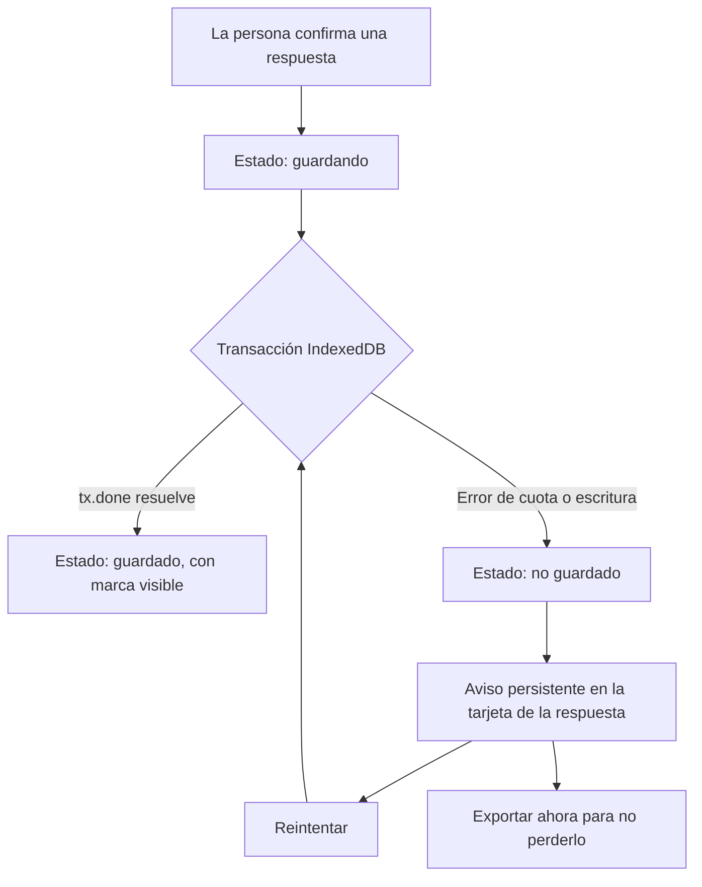
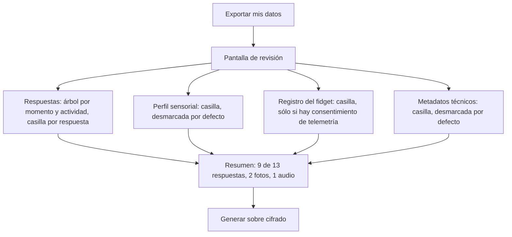
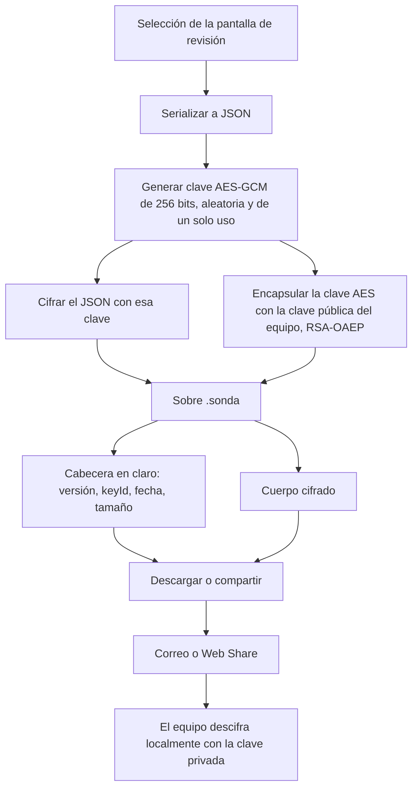
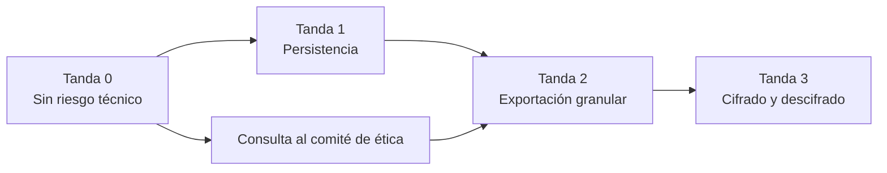

# Plan de remediación de la Sonda Digital

> **Estado: CERRADO.** Las seis críticas fueron implementadas entre el 10 y el 11 de agosto de 2026 (commits `548618d` y `ed05c62`, rama `dev`). Este documento se conserva como registro histórico para el comité de ética.

Proyecto FONDECYT Regular N° 1251541. Revisión del repositorio en el commit `daf1bf2` (v1.0.2), realizada el 10 de agosto de 2026.

Este documento responde a seis críticas planteadas sobre el estado actual de la aplicación. Para cada una registra el diagnóstico verificado en el código, el escenario negativo que puede desplegar en campo, la solución propuesta y los archivos afectados. Está escrito para ser leído tanto por el equipo de desarrollo como por el equipo de investigación y el comité de ética.

## Resumen para el equipo de investigación

Las seis críticas son correctas. Ninguna es un malentendido de lectura: todas se confirman línea por línea en el código actual. Tres de ellas son riesgos de pérdida de datos o de privacidad de la persona participante; tres son desajustes entre lo que la aplicación promete y lo que hace.

| # | Crítica | Escenario negativo concreto | Quién resulta afectado | Gravedad | Estado |
|---|---------|-----------------------------|------------------------|----------|--------|
| 1 | Todo vive en `localStorage`, sin aviso de fallo | Una participante graba un audio de tres minutos en el día 9. La cuota del navegador se agota. El error se imprime en una consola que ella nunca verá. Sigue respondiendo cuatro días más creyendo que todo se guarda. Al exportar descubre que faltan cinco actividades. | La participante y el estudio | Alta | **Resuelto el 11 de agosto de 2026** (tanda 1) |
| 2 | La exportación envía siempre el conjunto completo | Un participante quiere compartir sólo tres reflexiones textuales y guardarse las fotos de su dormitorio. El botón exporta todo: fotos, perfil sensorial, registro del fidget, modelo de teléfono y resolución de pantalla. No hay forma de quitar nada. | El participante | Alta | **Resuelto el 11 de agosto de 2026** (tanda 2) |
| 3 | El fidget registra uso sin informarlo | Una participante usa el fidget veinte veces en una semana difícil. Nunca se le dijo que se registraba el momento, la duración y el número de lanzamientos. Al abrir el archivo exportado ve un registro detallado de sus episodios de desregulación. | La participante | Alta | **Resuelto el 11 de agosto de 2026** (tanda 0) |
| 4 | El archivo viaja sin cifrar por correo | El JSON con audios y fotos queda en la carpeta de Descargas del teléfono, legible por cualquier aplicación con permiso de almacenamiento, y luego atraviesa servidores de correo de terceros y permanece en la bandeja de Enviados. | El participante y el equipo | Alta | **Resuelto el 11 de agosto de 2026** (tanda 3) |
| 5 | El consentimiento infiere retiro de la inactividad | Un participante deja de usar la app dos semanas por sobrecarga sensorial. El texto dice que eso puede leerse como retiro, pero el equipo no puede observar nada porque la app es local. Nadie lo contacta, nadie sabe, y él cree que ya fue dado de baja. | El participante | Media | **Resuelto el 11 de agosto de 2026** (tanda 0) |
| 6 | Servicio Gemini residual en el repositorio | Una auditoría del comité de ética encuentra un archivo que envía texto de participantes a un servicio externo de Google. Aunque nunca se ejecuta, contradice la declaración de que ningún dato sale del dispositivo. | La credibilidad del estudio | Media | **Resuelto el 10 de agosto de 2026** |

Hay además una consecuencia transversal que conviene decidir antes que cualquier línea de código: las correcciones 3, 4 y 5 modifican el texto del consentimiento informado. Si ya hay participantes en campo con el consentimiento actual firmado, corresponde consultar al comité de ética si basta una notificación o si se requiere re-consentimiento.[^1]

## Crítica 1. Persistencia frágil en localStorage

### Diagnóstico

`services/storageService.ts` guarda absolutamente todo bajo cuatro claves de `localStorage`. El árbol completo de momentos, con las fotos y audios embebidos como cadenas base64 dentro de `ResponseItem.content` (`types.ts:26`), se serializa entero en cada escritura desde `App.tsx:76`.

Los cinco puntos de escritura tragan el error de la misma forma:

```ts
} catch (e) {
  console.error('Error guardando progreso:', e);
}
```

No hay valor de retorno, no hay estado de error, no hay elemento de interfaz que cambie. La aplicación se comporta exactamente igual haya guardado o no.

Los números agravan el problema. La cuota habitual de `localStorage` es de 5 MB por origen. `ActivityView.tsx:134` acepta audios de hasta 4 MB en base64, y base64 infla el tamaño binario en un tercio. Un solo audio largo puede consumir casi toda la cuota disponible del estudio completo.

### Escenario negativo

| Momento | Qué ocurre en pantalla | Qué ocurre por debajo |
|---------|------------------------|------------------------|
| Día 9, 21:40 | La participante graba un audio de tres minutos y ve el botón "Guardando..." seguido de la respuesta en la lista. | `saveProgress` lanza `QuotaExceededError`. Se imprime en consola. El estado de React ya se actualizó, así que la respuesta aparece en pantalla. |
| Día 9, 21:41 | Cierra la aplicación tranquila. | Nada se escribió. La respuesta vivía sólo en memoria. |
| Día 10 | Abre la app. Su audio de ayer no está. Tampoco el texto del día 8. | `loadProgress` lee el último estado válido, anterior al desbordamiento. |
| Día 13 | Exporta y envía. | Faltan cinco actividades. Ni ella ni el equipo saben cuáles se perdieron ni cuándo. |

El daño no es sólo de datos. Para una persona que dedicó tiempo a formular una reflexión difícil, la desaparición silenciosa es una experiencia de la herramienta, y de quienes se la pidieron.

### Solución propuesta

Migrar el almacén a IndexedDB, guardando los medios como `Blob` binarios en lugar de base64, y hacer visible el estado de guardado de cada respuesta.



Elementos del diseño:

Base de datos `sonda`, versión 1, con cuatro almacenes de objetos. `responses` con clave `id` e índice por `activityId`, guardando texto y referencias a medios. `media` con clave `id` y valor `Blob`, separado para que una consulta del listado no cargue megabytes de audio. `meta` como pares clave-valor para consentimiento, perfil sensorial y banderas de onboarding. `usage` con clave autoincremental para los registros de uso.

Solicitud de persistencia con `navigator.storage.persist()` inmediatamente después del consentimiento, para que el navegador no desaloje los datos cuando el dispositivo tenga poco espacio. Sin esta llamada, IndexedDB en modo "best effort" puede vaciarse sin aviso, que es el mismo problema con otra cara.

Medición con `navigator.storage.estimate()` en cada apertura, con un aviso claro cuando quede menos del 15 % de holgura, sugiriendo exportar y liberar.

Escritura confirmada: `addResponse` devuelve una promesa y la interfaz no marca la respuesta como guardada hasta que la transacción resuelve. El estado por respuesta pasa a ser `guardando | guardado | no guardado`, y el tercero es visible y accionable.

Migración desde `localStorage`: al arrancar, si existen las claves antiguas y no existe `meta.migratedAt`, se leen, se convierten las cadenas `data:` en `Blob` mediante `fetch(dataUrl).then(r => r.blob())`, se escriben en IndexedDB y se marca la migración. Las claves antiguas se conservan un ciclo completo antes de limpiarse, para que un fallo de migración no sea destructivo.

`localStorage` queda únicamente para banderas triviales de onboarding y modo desarrollador, donde su fragilidad no tiene consecuencias.

Sin dependencias nuevas. Un envoltorio propio de unas ciento veinte líneas sobre la API nativa es suficiente y evita añadir peso a una PWA que debe funcionar sin red.[^2]

### Archivos afectados

`services/storageService.ts` se divide en `services/db.ts` (envoltorio de IndexedDB), `services/storageService.ts` (API de dominio, misma superficie pública) y `services/migration.ts`. `types.ts` incorpora el estado de guardado en `ResponseItem`. `App.tsx` deja de guardar en un `useEffect` sin retorno. `components/ActivityView.tsx` renderiza el estado por respuesta.

## Crítica 2. La exportación no permite selección granular

### Diagnóstico

`storageService.exportData()` (`storageService.ts:169-203`) construye un objeto fijo. No recibe parámetros. Incluye siempre `progress` completo, `sensoryProfile`, `usageLogs` y un bloque `deviceInfo` con `navigator.userAgent` íntegro y las dimensiones de pantalla.

El consentimiento, en cambio, promete otra cosa: "Puedes exportar y enviar tus datos en cualquier momento, incluso parcialmente" (`components/ConsentScreen.tsx:74`). La palabra "parcialmente" no tiene ninguna implementación detrás.

La especificación `specs/data-sovereignty.allium`, líneas 80 a 86, documenta el payload completo como comportamiento deliberado. Es decir, la brecha está también en el modelo, no sólo en el código.

El `userAgent` completo merece mención aparte: es una huella digital razonablemente identificadora, y combinado con la resolución de pantalla y las marcas de tiempo de respuesta, debilita el anonimato que promete el punto 5 del consentimiento.

### Escenario negativo

| Situación | Consecuencia |
|-----------|--------------|
| Un participante fotografió su habitación para ilustrar su entorno sensorial y luego se arrepintió. Quiere enviar sólo sus textos. | No puede. El botón exporta todo o nada. Su alternativa real es borrar la foto de la app, es decir, destruir el dato para no compartirlo. |
| Una participante no quiere que el equipo sepa cuánto usó el fidget, pero sí quiere aportar sus reflexiones. | No puede separarlos. |
| El comité de ética pregunta qué metadatos técnicos se recogen. | La respuesta es "el identificador completo del navegador y el tamaño de la pantalla, siempre, sin opción de excluirlos", lo que es difícil de justificar frente a un principio de minimización. |
| Un participante retira parcialmente su consentimiento y pide que se elimine una respuesta ya enviada. | El equipo debe editar a mano un JSON, sin garantía de trazabilidad. |

### Solución propuesta

Una pantalla intermedia obligatoria, "Revisa antes de enviar", entre la intención de exportar y la generación del archivo.



Reglas del diseño:

Todo lo que no sea una respuesta a una consigna del estudio va desmarcado por defecto. El perfil sensorial, el registro del fidget y los metadatos técnicos son opcionales, y la persona los añade si quiere.

Cada respuesta se puede previsualizar antes de decidir: el texto truncado, la miniatura de la foto, la duración del audio con reproducción.

`deviceInfo` deja de incluir el `userAgent` completo. Si el equipo necesita saber la plataforma para interpretar diferencias de grabación, basta con un campo declarado y grueso, del tipo `plataforma: "iOS" | "Android" | "escritorio"`.

El paquete exportado declara explícitamente lo que se omitió. Un bloque `omitido: { respuestas: 4, perfilSensorial: true, fidget: true }` permite al equipo distinguir entre una ausencia decidida por la persona y una pérdida técnica. Esta distinción es analíticamente relevante: una omisión deliberada es un dato sobre agencia.

La firma pasa a ser `exportData(selection: ExportSelection)` y `schemaVersion` sube a `2.0`.

### Archivos afectados

Nuevo `components/ExportReviewScreen.tsx`. `services/storageService.ts` cambia la firma de `exportData` y `prepareEmailData`. `App.tsx` enruta el botón de exportación a la nueva pantalla. `specs/data-sovereignty.allium` actualiza la guía de `DataExportConfirmed` y añade una regla de selección.

## Crítica 3. El fidget registra telemetría sin informarlo ni pedir consentimiento

### Diagnóstico

`components/FidgetTool.tsx:590-595` devuelve al cerrarse cuatro valores: `startTime`, `durationSeconds`, `shots` y `drags`. `App.tsx:160` los escribe como un registro `FIDGET_SESSION` sin intervención de la persona.

`components/FidgetIntroScreen.tsx` presenta la herramienta como un espacio libre: "Está hecho para relajarse... Sin reglas. Sin puntaje." No menciona el registro. El consentimiento, en su punto 3, sólo dice "Uso libre de la herramienta interactiva para el bienestar".

El desajuste es doble. La pantalla afirma que no hay puntaje justo antes de contar lanzamientos, y el consentimiento describe la herramienta sin describir la observación.

### Escenario negativo

| Situación | Consecuencia |
|-----------|--------------|
| Una participante atraviesa una semana de exámenes y usa el fidget veinte veces, varias de madrugada. | Queda registrado el momento exacto y la duración de cada episodio. Es, en la práctica, un registro de desregulación con marca temporal. |
| Al exportar, revisa el archivo. | Descubre una observación que nadie le anunció, en la parte de la aplicación que se le presentó como refugio sin reglas. |
| El comité de ética revisa el consentimiento firmado frente al dato recogido. | El dato de telemetría no está cubierto por lo consentido. |
| El equipo quiere usar el uso del fidget como indicador en el análisis. | El dato es inutilizable éticamente sin consentimiento previo específico. |

Hay una consideración adicional propia de este estudio. El marco es la Teoría de la Agencia Causal, y el instrumento se presenta como una sonda que aprende de la experiencia de la persona. Observar sin decirlo, precisamente en el espacio ofrecido como descanso, contradice el marco desde dentro.

### Solución propuesta

Informar en la pantalla del fidget, con un consentimiento separado del consentimiento general, revocable en cualquier momento y desactivado por defecto.

El texto propuesto para `FidgetIntroScreen`, en un bloque visualmente distinto del resto:

> **Sobre el registro de uso**
>
> Si tú lo autorizas, la sonda guarda en tu teléfono cuatro datos cada vez que cierras el fidget: cuándo lo abriste, cuántos minutos estuvo abierto, cuántas veces lanzaste la pelota y cuántas veces la arrastraste.
>
> No se graba nada de lo que ocurre en la pantalla, ni imagen, ni sonido. No hay puntaje ni comparación con nadie.
>
> Sirve para saber si una herramienta como esta le hace sentido a alguien, no para evaluarte a ti. Puedes decir que no y el fidget funciona exactamente igual. Puedes cambiar de opinión cuando quieras desde Ajustes.
>
> [ ] Sí, pueden guardar el registro de uso
> [ ] No, prefiero que no

Implementación: `meta.fidgetTelemetryConsent = { granted: boolean, decidedAt: string }`. Si `granted` es falso, `handleFidgetClose` no escribe nada, no en el sentido de escribir y filtrar después, sino de no generar el registro. El interruptor aparece también en `SensorySettings` para que sea revocable sin buscarlo. Al revocar, se ofrece borrar los registros ya acumulados.

En la pantalla de exportación, el bloque del fidget sólo aparece si hay consentimiento, y muestra su fecha.

Sobre el valor por defecto: recomiendo desactivado. La telemetría es accesoria a la pregunta de investigación, y un valor por defecto activado convierte el consentimiento en un trámite de desmarcado, que es exactamente la forma de consentimiento que el proyecto critica en otros sistemas.

### Archivos afectados

`components/FidgetIntroScreen.tsx`, `components/SensorySettings.tsx`, `App.tsx` (`handleFidgetClose`), `services/storageService.ts`, `specs/wellbeing.allium`, y el punto 3 del texto de `components/ConsentScreen.tsx`.

## Crítica 4. La transferencia es un JSON sin cifrar por mailto

### Diagnóstico

`storageService.prepareEmailData()` (`storageService.ts:205-211`) hace dos cosas: descarga el JSON en claro mediante un `Blob` y un enlace sintético, y luego abre el cliente de correo con `window.location.href = 'mailto:...'`. El cuerpo del correo pide a la persona que adjunte manualmente el archivo descargado.

El archivo en claro queda en la carpeta de descargas del dispositivo. En Android, cualquier aplicación con permiso de almacenamiento puede leerlo. Contiene audios de la voz de la persona, fotografías de sus espacios y reflexiones sobre su vida universitaria.

Enviado por correo, atraviesa al menos dos servidores de terceros, queda en la bandeja de Enviados del participante y en la bandeja de la investigadora, en ambos casos en claro y sujeto a la política de retención de esos proveedores.

La especificación `data-sovereignty.allium` justifica el paso manual de adjuntar como una garantía de conciencia: "This two-step design ensures the participant is aware that data is being sent". La intención es buena, pero protege contra el envío inadvertido, no contra la lectura por terceros, que es un riesgo distinto.

### Escenario negativo

| Vector | Qué expone |
|--------|-----------|
| El archivo permanece en Descargas indefinidamente. | Audios, fotos y textos legibles por otras apps del teléfono, o por quien tome el dispositivo prestado. |
| El teléfono se sincroniza con la nube del fabricante. | El JSON en claro se replica a un servicio no contemplado en el consentimiento. |
| El correo atraviesa servidores intermedios. | Contenido sensible sujeto a retención de terceros, fuera del alcance del protocolo. |
| El participante reenvía el correo o lo conserva en Enviados. | Copia permanente en claro en su propia cuenta. |
| Una cuenta de correo se ve comprometida. | El contenido íntegro de varios participantes queda expuesto de una vez. |

### Solución propuesta

Cifrar el paquete en el dispositivo antes de que toque el disco, con la clave pública del equipo investigador, usando WebCrypto y sin dependencias nuevas.



Elementos del diseño:

El equipo genera un par RSA-OAEP de 3072 bits una sola vez. La clave pública se incorpora al build como JWK, en `constants.ts` o como archivo en `public/`. La clave privada la custodia la investigadora responsable y nunca entra al repositorio.

Cada exportación genera su propia clave AES-GCM de un solo uso, de modo que dos envíos del mismo participante no comparten material criptográfico.

El sobre lleva una cabecera legible con la versión del esquema, el identificador de clave y la fecha, para que el equipo pueda ordenar y rotar claves sin descifrar nada.

La herramienta de descifrado es una única página HTML autónoma que el equipo abre localmente en su navegador, sin servidor y sin red: carga la clave privada, carga el sobre y devuelve el JSON. Se versiona junto al proyecto, en `tools/descifrar.html`.

El `mailto` se conserva, porque su función de hacer consciente el envío sigue siendo válida, pero el texto cambia para decir que el adjunto está cifrado y sólo el equipo puede abrirlo. En móviles compatibles se añade `navigator.share({ files })`, que elimina el paso manual de adjuntar sin cambiar el modelo de "nada sale sin tu acción".

Sobre la custodia: si se pierde la clave privada, los sobres son irrecuperables. El procedimiento debe fijarse antes de desplegar. Recomiendo dos copias en gestores de contraseñas distintos, en poder de dos personas del equipo, y el `keyId` en la cabecera para permitir rotación sin invalidar lo ya recibido.

### Archivos afectados

Nuevo `services/crypto.ts`. Nuevo `tools/descifrar.html`. `services/storageService.ts` reemplaza la descarga en claro. `constants.ts` incorpora la clave pública y su `keyId`. `specs/data-sovereignty.allium` añade una invariante de cifrado en reposo y en tránsito. El punto 4 del consentimiento se reescribe.

## Crítica 5. El consentimiento infiere retiro a partir de la inactividad

### Diagnóstico

`components/ConsentScreen.tsx:88`, punto 7:

> "Tu participación es voluntaria y no afecta tus notas. Puedes retirarte sin dar explicaciones. Entendemos que si dejas de usar la app, puede ser una señal de retiro."

La frase tiene dos problemas independientes.

El primero es técnico: la aplicación es estrictamente local y no emite ninguna señal. El equipo no puede observar que alguien dejó de usarla. La frase describe una capacidad de observación que no existe, lo que en un documento de consentimiento es una afirmación incorrecta.

El segundo es interpretativo, y es el más serio para este proyecto en particular. Inferir retiro de una interrupción es una inferencia pobre en cualquier población, y especialmente en esta: la interrupción puede deberse a sobrecarga sensorial, a un cambio de rutina, a un período de evaluaciones, a una crisis, o simplemente a que la herramienta dejó de tener sentido esa semana. Tratar la ausencia como decisión invisibiliza precisamente la clase de barreras que el estudio busca detectar.

### Escenario negativo

| Situación | Consecuencia |
|-----------|--------------|
| Un participante se detiene dos semanas por sobrecarga sensorial y luego quiere retomar. | Cree que ya fue dado de baja, porque el documento se lo dijo. No retoma. Se pierde un caso que precisamente ilustra la barrera que el estudio investiga. |
| Una participante quiere retirarse de verdad y confía en que dejar de abrir la app basta. | Nadie se entera. Sus datos, si ya los envió, siguen en el conjunto de análisis. No hay retiro efectivo. |
| El equipo interpreta los abandonos en el análisis. | No tiene forma de distinguir una pausa de un retiro, y el documento le dio permiso implícito para confundirlos. |

### Solución propuesta

Reemplazar el punto 7 por un texto que no infiera nada y que abra una vía activa. Propuesta:

> **7. Voluntariedad y derecho a retirarse**
>
> Tu participación es voluntaria y no afecta tus notas ni tu situación académica. Puedes retirarte cuando quieras, sin dar explicaciones.
>
> Puedes dejar de usar la aplicación durante días o semanas y retomar después. Una pausa no es un retiro, y la aplicación no informa a nadie de cuándo la usas: todo ocurre en tu teléfono.
>
> Si decides retirarte, avísanos por correo o WhatsApp desde el botón "Quiero retirarme" que está en Ayuda. Si ya nos habías enviado datos, dinos si quieres que los eliminemos. Si no nos avisas, entenderemos que sigues participando y simplemente no has usado la app estos días.

Adicionalmente, un botón "Quiero retirarme" dentro de `HelpModal`, que abra el contacto ya redactado y ofrezca, en el mismo lugar, borrar los datos locales, con la advertencia de que el borrado local no alcanza a lo ya enviado.

Este cambio, además de corregir el documento, produce un dato mejor: un retiro declarado es información útil; una ausencia es ruido.

### Archivos afectados

`components/ConsentScreen.tsx` punto 7. `components/HelpModal.tsx`. `constants.ts` (`HELP_CONTENT`). `specs/participant.allium`, donde se modela el estado de retiro.

## Crítica 6. Servicio Gemini residual

Estado: resuelto el 10 de agosto de 2026.

### Qué quiere decir "residual"

En términos llanos: es un archivo que quedó de una versión anterior de la sonda, cuando se exploró la idea de que la aplicación devolviera un comentario amable generado por inteligencia artificial después de cada respuesta. Esa idea se descartó, pero el archivo nunca se borró.

"Residual" significa exactamente eso: está en el repositorio, se lee, se puede auditar y se puede citar, pero ninguna parte de la aplicación lo llama y no llega al teléfono de nadie. Es sedimento, no funcionalidad.

El riesgo no era técnico sino de coherencia. La declaración central del proyecto es que ningún dato sale del dispositivo, y en el mismo repositorio convivía una función cuyo propósito documentado era enviar el texto de la persona participante a un servidor de Google.

### Diagnóstico

`services/geminiService.ts` importaba `GoogleGenAI` desde `@google/genai` y definía `generateSupportiveFeedback`, que enviaba el texto escrito por la persona participante a un modelo de Google.

Verificaciones realizadas sobre el repositorio antes de eliminarlo:

El paquete `@google/genai` no estaba declarado en `package.json`, ni en dependencias ni en dependencias de desarrollo. Ningún archivo del proyecto importaba `geminiService`. La única aparición de `API_KEY` en todo el código fuente estaba dentro de ese archivo. No había definiciones de `API_KEY` en `vite.config.ts` ni en los dos flujos de `.github/workflows/`.

Es decir, era código muerto que además no habría compilado si alguien lo hubiera importado.

### Lo que se hizo

El archivo se retiró de `services/` el 10 de agosto de 2026. Comprobaciones posteriores:

`grep` sobre todo el árbol de fuentes no encuentra ninguna referencia restante a `geminiService` ni a `@google/genai`.

`npx tsc --noEmit` deja de reportar el único error de módulo faltante del proyecto (`Cannot find module '@google/genai'`). Los errores de `import.meta.env` que persisten son preexistentes y no relacionados: provienen de que `tsconfig.json` no incluye los tipos `vite/client`, y conviene corregirlos en la tanda 0 por separado.

Queda pendiente confirmar el borrado con un commit. El archivo se movió a la carpeta `_to_delete/` en la raíz del repositorio, que debe eliminarse manualmente.[^4]

### Escenario negativo

| Situación | Consecuencia |
|-----------|--------------|
| El comité de ética o una revisión externa auditan el repositorio. | Encuentran un archivo cuya función documentada es enviar texto de participantes a un servicio externo. La declaración de que ningún dato sale del dispositivo queda en entredicho, aunque el archivo no se ejecute. |
| Alguien retoma el proyecto en un año y encuentra el archivo. | Puede reactivarlo creyendo que era una funcionalidad pendiente, y con ello romper la invariante central del diseño sin advertirlo. |
| Se publica el repositorio como material del proyecto. | La contradicción queda pública. |

### Lo que queda por hacer

Dejar constancia de la decisión en `specs/data-sovereignty.allium`, junto a la invariante `NoSilentTransmission`, en el sentido de que cualquier retroalimentación generativa futura implicaría transmisión de contenido de la persona a un tercero y por tanto exige consentimiento específico y una revisión del modelo, no una simple reactivación.

Esta anotación importa más que el borrado. Sin ella, la idea puede volver en un año sin que nadie recuerde por qué se descartó.

## Orden de trabajo



**Tanda 0.** Reescribir el punto 7 del consentimiento, añadir el botón de retiro, e informar y pedir consentimiento de la telemetría del fidget. No toca la persistencia ni el formato de exportación, así que puede desplegarse de inmediato. Cubre las críticas 3 y 5. La crítica 6, que también pertenecía a esta tanda, ya está ejecutada. Conviene añadir aquí también los tipos `vite/client` a `tsconfig.json`, que es la causa de los errores de `import.meta.env` que hoy ensucian la comprobación de tipos.

**Tanda 1.** Migración a IndexedDB con estado de guardado visible y migración desde `localStorage`. Es el cambio de mayor superficie y el que más pruebas requiere, sobre todo en iOS, donde la PWA aísla el almacenamiento respecto del navegador.[^3] Cubre la crítica 1.

**Tanda 2.** Pantalla de revisión y exportación selectiva, con el esquema `2.0`. Depende de la tanda 1 porque el árbol de selección lee del nuevo almacén. Cubre la crítica 2.

**Tanda 3.** Cifrado del sobre y herramienta de descifrado. Depende de la tanda 2 porque cifra el resultado de la selección. Requiere que la custodia de la clave privada esté resuelta antes de desplegar. Cubre la crítica 4.

## Decisiones pendientes antes de empezar

Custodia de la clave privada del equipo: quiénes la tienen, dónde, y qué ocurre si se pierde.

Valor por defecto de la telemetría del fidget: la recomendación de este documento es desactivado, pero la decisión corresponde al equipo de investigación.

Situación de los participantes que ya firmaron el consentimiento actual: notificación o re-consentimiento, según indique el comité.

Retención del `userAgent`: si el equipo tiene una razón analítica para conservar algún metadato técnico, conviene declararla ahora para diseñar el campo mínimo suficiente en lugar de eliminarlo del todo.

## Especificaciones Allium que quedan desalineadas

`specs/data-sovereignty.allium`: la guía de `DataExportConfirmed` (líneas 73 a 87) describe el payload completo y el adjunto manual como comportamiento correcto. Requiere actualizarse en las tandas 2 y 3, añadiendo una regla de selección y una invariante de cifrado.

`specs/wellbeing.allium`: no modela el consentimiento de telemetría del fidget. Requiere una regla nueva en la tanda 0.

`specs/participant.allium`: el retiro no está modelado en absoluto. Aparece sólo como pregunta abierta en la línea 444, "Can a participant withdraw consent after accepting? If so, what happens to their existing data". La tanda 0 debe convertir esa pregunta en reglas: retiro declarado, nunca inferido, y qué ocurre con los datos ya enviados.

[^1]: Esta consulta condiciona el calendario completo. Si el comité exige re-consentimiento, conviene agrupar todos los cambios de texto en una sola versión del documento en lugar de reescribirlo en cada tanda.

[^2]: Si se prefiere una dependencia, `idb` de Jake Archibald pesa alrededor de 1 kB comprimida y es la opción estándar. La recomendación de no usarla responde sólo a mantener el árbol de dependencias mínimo en un proyecto que debe seguir compilando sin cambios dentro de varios años.

[^3]: En iOS, una PWA instalada en la pantalla de inicio no comparte almacenamiento con Safari. Este comportamiento ya está contemplado en `App.tsx:50-52` para el consentimiento, y hay que verificarlo también para IndexedDB durante la migración.

[^4]: El entorno desde el que se hizo la corrección puede mover archivos dentro del repositorio pero no borrarlos del disco. De ahí la carpeta intermedia. Para git el efecto ya es el correcto: `git status` muestra `D services/geminiService.ts`.
