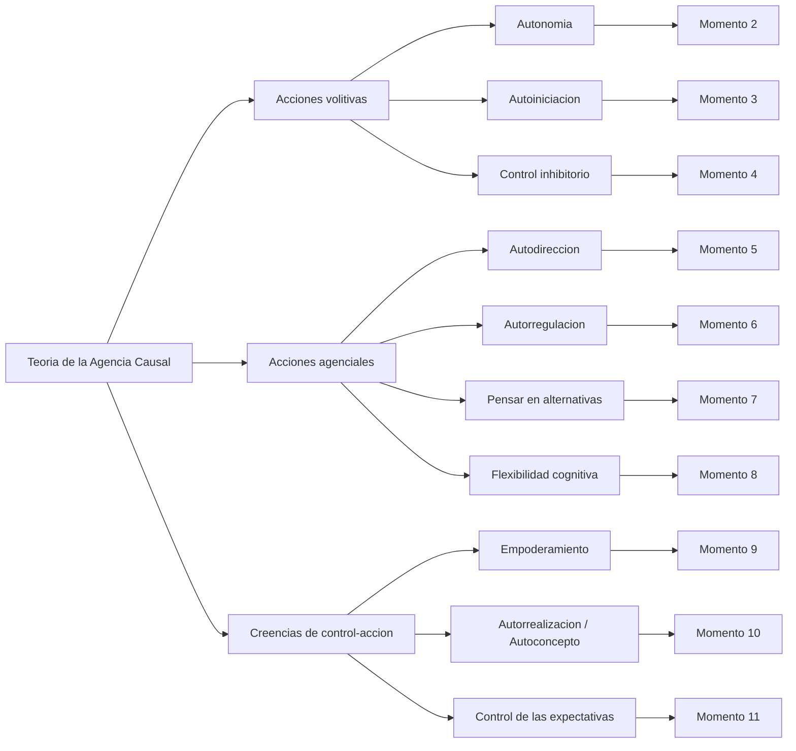
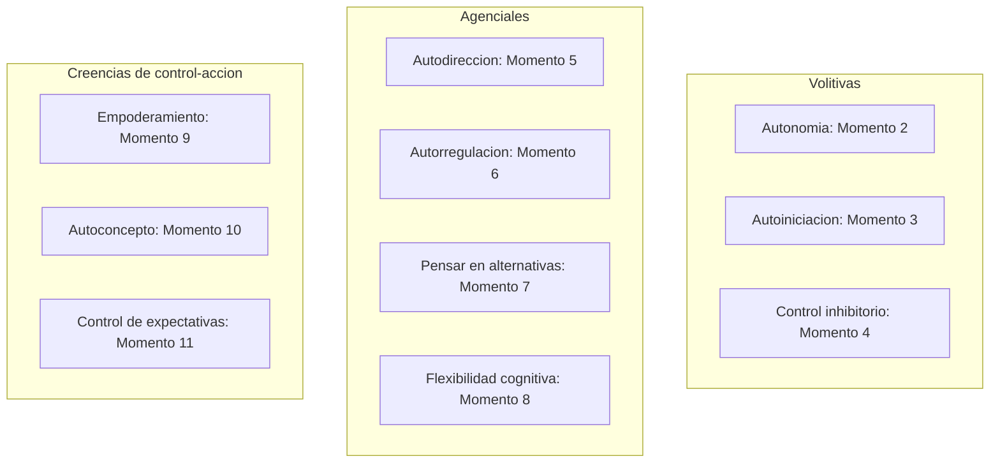

# Banco de Actividades de Autorreporte por Dimensión (Teoría de la Agencia Causal)

Este documento propone un banco curado de actividades de autorreporte para la sonda digital, reorganizado según las dimensiones y subdimensiones de la Teoría de la Agencia Causal (TAC)[^tac]. Sustituye la lógica de "semanas" por una lógica de "momentos" más breves y reincorpora las observaciones de la revisión colectiva (Félix y Jennifer), las recomendaciones de AASPIRE[^aaspire] y de Stacey y Cage (2023)[^stacey].

## Por qué pasar de semanas a momentos

La estructura semanal original asume que el participante mantiene la continuidad a lo largo de siete días. En la práctica, una semana es un intervalo largo: diluye la tensión narrativa, reduce el interés y rompe el hilo de la experiencia. Los "momentos" son disparos cortos y autocontenidos que pueden entregarse en un ritmo más apretado (por ejemplo, uno por día o uno cada dos días), lo que sostiene la continuidad, mantiene la motivación y captura experiencias más recientes y precisas. Cada momento contiene una sola actividad, para no sobrecargar.

Cada actividad conserva los principios de diseño anti-ambigüedad de la sonda original: instrucciones claras, ejemplos concretos como andamiaje[^scaffolding], opciones de respuesta multimodales y validación previa de la experiencia. Adicionalmente, cada actividad incorpora dos mejoras pedidas en la revisión: una opción de salida[^salida] (para quien no haya vivido la situación) y un anclaje de evento[^anclaje] (para ayudar a recordar un episodio concreto en lugar de responder en abstracto).

## Mapa de dimensiones, subdimensiones y momentos

El Momento 1 es un momento de entrada sensorial (sin dimensión asignada de la TAC) que prepara el autoconocimiento y alimenta varias subdimensiones posteriores.

## Momento 1 (entrada): Mi entorno y mis sentidos

Este momento inicial no evalúa una subdimensión de la TAC, sino que establece una base de autoconocimiento sensorial sobre la cual se apoyan, más adelante, la autorregulación y el autoconcepto. Recoge las dos actividades sensoriales originales, ya refinadas según los comentarios de Félix.

### Actividad de entrada A: Mapa de lugares

Pregunta: La universidad tiene lugares que nos dan seguridad y lugares que nos la quitan. Sube una foto o describe un lugar del campus donde te sientas seguro o segura, y otro donde te sientas abrumado o abrumada.

Ejemplo: una foto de una biblioteca vacía (seguro) y una foto de la cafetería llena (abrumado).

Modalidades: foto, texto, audio.

### Actividad de entrada B: Cazadores de ruido y luz

Pregunta: ¿Hay algo en el lugar donde estás estudiando hoy (un ruido, una luz o una textura) que te distraiga o te resulte incómodo? Toma una foto de la luz o textura, graba un audio corto del ruido, o escribe una breve descripción de lo que te molesta. Si quieres, cuéntanos también cómo afecta esto a tu estudio y si haces algo para que te moleste menos. Si hoy no hay nada que te incomode, también puedes decirlo.

Modalidades: audio (grabar el ruido), foto (capturar la luz o textura), texto.

## Dimensión 1: Acciones volitivas

La persona actúa de acuerdo con sus propias preferencias, intereses o capacidades, y de manera independiente.

### Momento 2 — Subdimensión: Autonomía

Actuar de manera independiente en los distintos contextos, según los intereses y preferencias personales.

Pregunta: Cada persona tiene su propia manera de estudiar. Piensa en una tarea de estudio que hiciste hace poco y que decidiste hacer a tu manera: dónde, cuándo o cómo. Cuéntanos qué elegiste y por qué esa manera te funciona a ti. Si esta vez seguiste la manera de otra persona, también puedes contarlo.

Ejemplo: "Preferí estudiar de noche con audífonos en mi pieza, porque de día hay mucho ruido en la casa."

Modalidades: texto, audio, foto.

### Momento 3 — Subdimensión: Autoiniciación

Iniciar voluntariamente actividades y hacer elecciones conscientes basadas en preferencias e intereses.

Pregunta: Piensa en estos últimos días. ¿Hubo algo relacionado con tus estudios que empezaste por tu cuenta, sin que nadie te lo pidiera? Por ejemplo: repasar un tema, escribirle a un compañero, ordenar tu material o buscar información. Si ocurrió, cuéntanos qué fue y qué te llevó a empezarlo. Si no ocurrió, también puedes decirlo.

Ejemplo: "Decidí adelantar la lectura de la próxima clase porque me daba curiosidad el tema."

Modalidades: texto, audio.

### Momento 4 — Subdimensión: Control inhibitorio

Detener una respuesta automática o resistir una distracción o un impulso para sostener la acción dirigida a una meta[^inhibitorio].

Pregunta: A veces, mientras estudiamos, aparece algo que nos da ganas de parar o de hacer otra cosa: el teléfono, un ruido, ganas de levantarse. Piensa en un momento reciente en que sentiste esas ganas de interrumpir lo que hacías, pero decidiste seguir. ¿Qué hiciste para mantenerte en la tarea? Si en cambio dejaste la tarea, también puedes contarlo, no hay respuesta correcta.

Ejemplo: "Quería revisar el celular, así que lo dejé en otra pieza hasta terminar."

Modalidades: texto, audio.

## Dimensión 2: Acciones agenciales

La persona examina su entorno y sus repertorios de respuesta para decidir cómo y cuándo actuar, y para evaluar y revisar sus planes según los resultados.

### Momento 5 — Subdimensión: Autodirección

Usar estrategias para dirigir las acciones hacia un resultado y actuar al servicio de objetivos libremente escogidos.

Pregunta: Piensa en lo que querías lograr hoy (o en tu sesión de estudio más reciente). ¿Qué te propusiste hacer y qué pasos diste para acercarte a eso? Cuéntanos tu meta y lo que hiciste. Si hoy no te propusiste nada en particular, también puedes decirlo.

Ejemplo: "Mi meta era terminar dos ejercicios; partí por el más fácil para tomar impulso."

Modalidades: texto, audio, foto (por ejemplo, de tu lista de tareas).

### Momento 6 — Subdimensión: Autorregulación

Identificar el camino hacia una meta y ajustar la dirección cuando surgen retos.

Pregunta: Piensa en estos días. ¿Hubo algún momento en que tuviste que cambiar tus planes de estudio o dejar algo para después? Si ocurrió, cuéntanos qué pasó y cómo te sentiste con ese cambio. Si no ocurrió, también puedes decirlo.

Ejemplo: puedes subir una foto de tu agenda con cambios, o grabar un audio explicando.

Modalidades: foto, audio, texto.

Nota de revisión: esta formulación incorpora la sugerencia de Jennifer de no asumir que el cambio de planes ocurrió ni que se debió solo a falta de energía. Por eso se eliminó la referencia a la "teoría de las cucharas" como supuesto y se añadió la opción de salida[^salida].

### Momento 7 — Subdimensión: Pensar en alternativas

Pensar en diferentes opciones de acción para superar obstáculos.

Pregunta: Cuando algo no resulta como esperabas (una instrucción confusa, una tarea más difícil de lo previsto, un material que no encuentras), a veces hay que pensar en otra forma de resolverlo. Piensa en una situación reciente así. ¿Qué otras opciones se te ocurrieron? Cuéntanos qué alternativas pensaste, aunque al final no las hayas usado. Si no recuerdas una situación así, también puedes decirlo.

Ejemplo: "No entendía la consigna, así que pensé en preguntarle al profesor, revisar el apunte de un compañero o buscarlo en internet."

Modalidades: texto, audio.

### Momento 8 — Subdimensión: Flexibilidad cognitiva

Adaptarse a cambios inesperados y cambiar de enfoque cuando la situación lo requiere[^flexibilidad].

Pregunta: A veces las cosas cambian de un momento a otro: se mueve una fecha de entrega, cambian la sala, un profesor pide algo distinto a lo anunciado. Piensa en un cambio inesperado que hayas vivido hace poco en la universidad. ¿Cómo te adaptaste a ese cambio? Si te costó adaptarte, también puedes contarlo: nos sirve igual.

Ejemplo: "Cambiaron la prueba de día y tuve que reorganizar todo mi estudio de la semana."

Modalidades: texto, audio.

## Dimensión 3: Creencias de control-acción

La persona actúa con un conocimiento comprensivo de sí misma, de sus fortalezas y limitaciones, y emplea ese conocimiento para alcanzar metas valiosas.

### Momento 9 — Subdimensión: Empoderamiento

Sentirse capaz de defenderse, expresar los propios derechos, intereses u opiniones.

Pregunta: Piensa en las cosas que más te ayudan o te ayudarían en tus clases. Si pudieras pedirle a tus profesores algunas formas concretas de apoyarte mejor, ¿cuáles serían? Pueden ser una, dos o las que necesites.

Ejemplo: "Avisarme antes de pedirme hablar en público" o "darme las instrucciones por escrito".

Modalidades: texto, audio.

Nota de revisión: incorpora la sugerencia de Jennifer de evitar la palabra "reglas" (que suena rígida) y de no fijar la cantidad en tres, dejándola abierta a lo que la persona identifique.

### Momento 10 — Subdimensión: Autorrealización / Autoconcepto

Conocer las propias capacidades, necesidades y apoyos necesarios para alcanzar una meta.

Pregunta: Todos tenemos cosas que hacemos bien y cosas en las que necesitamos más apoyo. Pensando en ti como estudiante, cuéntanos una cosa que se te da bien cuando estudias y una cosa en la que necesitas más ayuda. No hay respuestas mejores ni peores.

Ejemplo: "Se me da bien organizar mis apuntes con colores; me cuesta más concentrarme cuando hay mucha gente alrededor."

Modalidades: texto, audio.

### Momento 11 — Subdimensión: Control de las expectativas

Creencias sobre la conexión entre la propia persona (y sus acciones) y los resultados que obtiene.

Pregunta: Piensa en algo que lograste en tus estudios este mes, aunque sea pequeño (entender un tema, entregar a tiempo, animarte a preguntar). ¿Qué hiciste tú que ayudó a que saliera bien? Cuéntanos qué parte de ese resultado tuvo que ver con algo que tú hiciste. Si sientes que no dependió de ti, también puedes contarlo.

Ejemplo: "Entregué a tiempo porque me hice un calendario y empecé antes de lo habitual."

Modalidades: texto, audio, video.

### Cierre opcional: Mensaje al futuro

Esta actividad de la sonda original funciona bien como cierre, ya que conecta el esfuerzo presente con la proyección personal (control de las expectativas y autoconcepto).

Pregunta: Imagina que te estás graduando y puedes dejarte un mensaje para recordar este momento de tu vida. Pensando en tus rutinas y tareas de estos días, ¿qué cosas concretas te gustaría recordar sobre cómo lograste avanzar en tus estudios? Graba un audio o un video corto, o escribe un texto contándonos qué te dirías.

Modalidades: audio, video, texto.

## Secuencia de entrega sugerida

La siguiente tabla ordena los momentos para sostener continuidad y tensión, partiendo de lo concreto y de bajo costo emocional (entorno, autonomía) y avanzando hacia lo más reflexivo (identidad, creencias de control). El ritmo sugerido es un momento por día o cada dos días.

| Orden | Momento | Dimensión | Subdimensión | Foco de la experiencia |
|-------|---------|-----------|--------------|------------------------|
| 1 | Entrada | (sensorial) | Autoconocimiento sensorial | Entorno y sentidos |
| 2 | Momento 2 | Volitiva | Autonomía | Mi manera de hacer las cosas |
| 3 | Momento 3 | Volitiva | Autoiniciación | Empezar por cuenta propia |
| 4 | Momento 4 | Volitiva | Control inhibitorio | Sostener la tarea |
| 5 | Momento 5 | Agencial | Autodirección | Mi meta y mis pasos |
| 6 | Momento 6 | Agencial | Autorregulación | Cambiar de plan |
| 7 | Momento 7 | Agencial | Pensar en alternativas | Plan B |
| 8 | Momento 8 | Agencial | Flexibilidad cognitiva | Cuando algo cambia |
| 9 | Momento 9 | Control-acción | Empoderamiento | Formas de apoyo |
| 10 | Momento 10 | Control-acción | Autorrealización / Autoconcepto | Lo que sé de mí |
| 11 | Momento 11 | Control-acción | Control de las expectativas | Esfuerzo y resultado |
| Cierre | Mensaje al futuro | Control-acción | Proyección | Mensaje al yo futuro |

## Resumen de cobertura teórica

Cada subdimensión de la TAC queda cubierta por exactamente una actividad principal, lo que permite asociar de manera limpia cada respuesta con un componente del modelo. El momento de entrada y el cierre funcionan como envolturas afectivas que abren y cierran la experiencia sin sobrecargar la evaluación.

[^tac]: Teoría de la Agencia Causal (Shogren, Wehmeyer, Palmer, Forber-Pratt et al., 2015; Shogren y Raley, 2022). Define la autodeterminación a partir de tres características esenciales (acciones volitivas, acciones agenciales y creencias de control-acción) y sus subdimensiones. Las descripciones de cada componente provienen de la Escala AUTODDIS (Verdugo, Vicente, Guillén et al., INICO, Universidad de Salamanca, 2021) y del marco actualizado de Shogren y Raley (2022).

[^aaspire]: AASPIRE (Academic Autism Spectrum Partnership in Research and Education) recomienda anclar los eventos recordados para favorecer relatos más profundos, sustituir figuras retóricas y vocabulario difícil por términos directos, e incluir definiciones de los términos que puedan resultar poco claros.

[^stacey]: Stacey y Cage (2023) señalan que los cuestionarios dirigidos a personas autistas requieren claridad y contexto, porque las respuestas varían según la situación y las preguntas demasiado generales o con supuestos dificultan respuestas precisas.

[^scaffolding]: Andamiaje (scaffolding): técnica pedagógica que consiste en proporcionar apoyo temporal y ajustado para que la persona alcance un nivel de comprensión o desempeño que no lograría por sí sola. En la sonda se traduce en ejemplos concretos junto a cada pregunta.

[^salida]: Opción de salida: una alternativa explícita ("si no ocurrió, también puedes decirlo") que evita forzar al participante a inventar un ejemplo cuando no ha vivido la situación descrita. Recoge la observación de Jennifer y la recomendación de Stacey y Cage (2023).

[^anclaje]: Anclaje de evento: pedir al participante que recuerde un episodio específico y reciente ("piensa en un momento de estos días en que...") en lugar de responder en abstracto. Recoge la recomendación de AASPIRE de ayudar a anclar los eventos recordados.

[^inhibitorio]: Control inhibitorio: capacidad de detener o frenar una respuesta automática o un impulso para mantener la conducta orientada a una meta. Es una de las subdimensiones añadidas a las acciones volitivas en la formulación de Shogren y Raley (2022).

[^flexibilidad]: Flexibilidad cognitiva: capacidad de adaptar el pensamiento y la conducta ante cambios o situaciones nuevas, cambiando de enfoque cuando hace falta. Es una de las subdimensiones añadidas a las acciones agenciales en la formulación de Shogren y Raley (2022).
